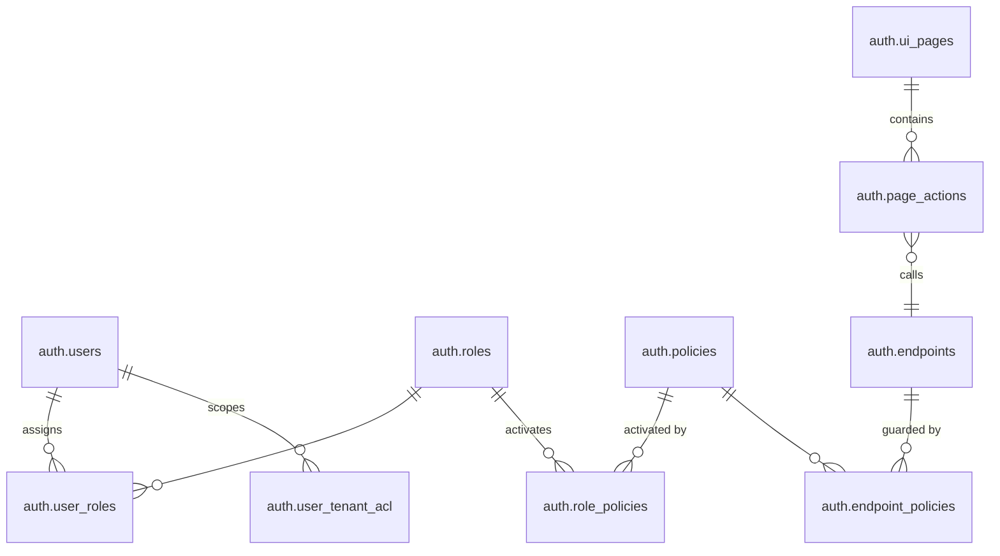

# Data Map & Relationships

**Navigation:** Previous: [Architecture Overview](overview.md) → Next: [Journey: Login To Data](../guides/login-to-data.md)

This guide maps the PostgreSQL tables that power authentication and authorization. Use it when you need to understand how roles, policies, endpoints, and tenant scopes join together.

## Core Entities



**Key Relationships:**
- **Solid lines** (||--o{): Direct foreign key relationships in the database
- **Role-Policy Junction**: `auth.role_policies` table provides proper many-to-many relationship between roles and policies

**Policy-Role Binding:**
The `auth.role_policies` junction table creates a proper relational many-to-many link:
```sql
-- role_policies table structure
CREATE TABLE auth.role_policies (
    id BIGSERIAL PRIMARY KEY,
    role_id BIGINT NOT NULL REFERENCES auth.roles(id),
    policy_id BIGINT NOT NULL REFERENCES auth.policies(id),
    assigned_at TIMESTAMP NOT NULL DEFAULT CURRENT_TIMESTAMP,
    assigned_by BIGINT REFERENCES auth.users(id),
    is_active BOOLEAN NOT NULL DEFAULT TRUE,
    conditions JSONB,  -- Optional ABAC conditions
    priority INTEGER,   -- Policy precedence
    UNIQUE(role_id, policy_id)
);
```

When checking permissions, the system:
1. Gets user's roles from `user_roles`
2. Finds policies linked to those roles via `role_policies` junction table
3. Validates that at least one policy matches the requested endpoint via `endpoint_policies`

## Entity Descriptions

### 🔐 **auth.users** - Core User Records
Stores human users and service accounts. Every login, API call, and permission check starts here.

| Column | Type | Purpose |
| --- | --- | --- |
| `id` | UUID | Primary key |
| `username` | TEXT | Unique login identifier |
| `email` | TEXT | Contact information |
| `status` | ENUM | ACTIVE, DISABLED, LOCKED |
| `is_service_account` | BOOLEAN | Flag for service accounts (token-only) |
| `created_at` | TIMESTAMP | Audit trail |

**Examples:**
- `worker.demo` (human user, WORKER role)
- `employer.acme` (human user, EMPLOYER role)
- `payment-sync-bot` (service account, automation)

---

### 👤 **auth.roles** - Responsibility Badges
Groups users by job function. Think of roles as "responsibility badges" that multiple people wear.

| Column | Type | Purpose |
| --- | --- | --- |
| `id` | UUID | Primary key |
| `name` | TEXT | Role name (e.g., WORKER, EMPLOYER, ADMIN) |
| `description` | TEXT | Purpose and scope |
| `is_active` | BOOLEAN | Enable/disable entire role |

**Examples:**
- WORKER - Employees submitting payment docs
- EMPLOYER - Managers reviewing submissions
- BOARD - C-suite approval authority
- PLATFORM_ADMIN - System maintenance

**Typical Count:** 5-10 roles per organization

---

### 📋 **auth.policies** - Rulebooks
Authorization policies tied to roles via the `role_policies` junction table. A policy represents a collection of permissions that determine what endpoints a role can access.

| Column | Type | Purpose |
| --- | --- | --- |
| `id` | BIGINT | Primary key |
| `name` | VARCHAR | Policy name (e.g., USER_ACCOUNT_MANAGE_POLICY) |
| `description` | TEXT | Intent and scope |
| `type` | VARCHAR | Policy type (RBAC, ABAC, CUSTOM) |
| `conditions` | JSONB | Optional ABAC conditions (tenant_id, time_range, etc.) |
| `is_active` | BOOLEAN | Enable/disable entire policy |

**Example:**
```sql
-- Policy record
INSERT INTO auth.policies (name, description, type, is_active)
VALUES (
  'USER_ACCOUNT_MANAGE_POLICY',
  'Manage user accounts and lifecycle operations',
  'RBAC',
  true
);

-- Link to roles via role_policies junction table
INSERT INTO auth.role_policies (role_id, policy_id, is_active)
SELECT r.id, p.id, true
FROM auth.roles r, auth.policies p
WHERE r.name IN ('BUSINESS_ADMIN', 'TECHNICAL_BOOTSTRAP')
  AND p.name = 'USER_ACCOUNT_MANAGE_POLICY';
```

**Role-Policy Relationship:**
The `auth.role_policies` junction table creates a proper many-to-many relationship between roles and policies.

**How it works:**
```sql
-- Query: Which policies apply to a user with BUSINESS_ADMIN role?
SELECT p.id, p.name
FROM auth.policies p
JOIN auth.role_policies rp ON p.id = rp.policy_id
JOIN auth.roles r ON rp.role_id = r.id
WHERE r.name = 'BUSINESS_ADMIN'
  AND p.is_active = true
  AND rp.is_active = true;

-- Result: USER_ACCOUNT_MANAGE_POLICY (and any other policies linked to BUSINESS_ADMIN)
```

**Complete Authorization Chain:**
```
User (business.admin)
  ↓ user_roles
Role (BUSINESS_ADMIN)
  ↓ role_policies (junction table)
Policy (USER_ACCOUNT_MANAGE_POLICY)
  ↓ endpoint_policies
Endpoints (POST /api/users, GET /api/users/:id, PUT /api/users/:id, ...)
```

**Bootstrap Examples:**
| Policy | Linked Roles | Protected Endpoints |
|--------|-------------|---------------------|
| BASIC_USER_POLICY | BASIC_USER | Profile & Auth endpoints |
| USER_ACCOUNT_MANAGE_POLICY | BUSINESS_ADMIN, TECHNICAL_BOOTSTRAP | User CRUD operations |
| RBAC_FULL_POLICY | TECHNICAL_BOOTSTRAP | Role, Policy, Endpoint management |

---

### � **auth.page_actions** - UI Action Bindings
Links UI actions to endpoints (API calls) for UI rendering and authorization. Determines which buttons/actions appear on each page and which APIs they invoke.

| Column | Type | Purpose |
| --- | --- | --- |
| `id` | BIGINT | Primary key |
| `page_id` | INTEGER | FK to ui_pages (which page) |
| `label` | VARCHAR | Button/action label (e.g., "Edit User") |
| `action` | VARCHAR | Action type (CREATE, UPDATE, DELETE, etc.) |
| `endpoint_id` | BIGINT | FK to endpoints (API call target + permission check) |
| `icon` | VARCHAR | Icon name for UI |
| `variant` | VARCHAR | Button style (default, success, danger, etc.) |

**Purpose:**
- **API Binding**: `endpoint_id` → Which endpoint to call when clicked?
- **Permission Check**: Endpoint policies determine if user can access the action
- **UI Rendering**: Label, icon, and variant define how the button appears

**Example:**
```sql
-- "Edit User" button on User Management page
INSERT INTO auth.page_actions (page_id, label, action, endpoint_id, icon, variant)
VALUES (
  2,                          -- User Management page
  'Edit User',
  'UPDATE',
  71,                         -- endpoint: PUT /api/auth/users/{userId}
  'edit',
  'default'
);
```

**Frontend Flow:**
```
GET /api/meta/endpoints?page_id=2
  ↓
Returns page_actions for the page
  ↓
Backend filters based on user's policies → endpoint_policies
  ↓
Frontend renders buttons only for authorized endpoints
```

---

### 🔗 **auth.endpoints** - HTTP Guards
Every API endpoint that needs protection is registered here. Defines method + path + requirements.

| Column | Type | Purpose |
| --- | --- | --- |
| `id` | BIGINT | Primary key |
| `service` | VARCHAR | Service name (AUTH, ADMIN, INTERNAL) |
| `version` | VARCHAR | API version (v1, v2) |
| `method` | VARCHAR | GET, POST, PUT, DELETE, PATCH |
| `path` | VARCHAR | Route pattern (e.g., /api/auth/users/{userId}) |
| `description` | TEXT | Human description |
| `ui_type` | VARCHAR | UI interaction type (ACTION, LIST, FORM, etc.) |
| `is_active` | BOOLEAN | Enable/disable endpoint |
| `created_at` | TIMESTAMP | Audit |
| `updated_at` | TIMESTAMP | Last modified |

**Examples:**
- GET `/api/auth/users` → List all users (endpoint_id: 5)
- POST `/api/auth/users` → Create new user (endpoint_id: 3)
- PUT `/api/auth/users/{userId}` → Update user (endpoint_id: 71)
- DELETE `/api/auth/users/{userId}` → Delete user (endpoint_id: 72)

**Bootstrap Setup:** 72 endpoints registered
- AUTH service: 14 endpoints
- ADMIN service: 51 endpoints  
- INTERNAL service: 5 endpoints

---

### 🔐 **auth.ui_pages** - Front-End Surfaces
Pages/sections in the UI. Organized hierarchically with parent-child relationships.

| Column | Type | Purpose |
| --- | --- | --- |
| `id` | BIGINT | Primary key |
| `page_id` | VARCHAR | Unique identifier (e.g., user-mgmt, role-mgmt) |
| `label` | VARCHAR | Display name |
| `route` | VARCHAR | URL path |
| `icon` | VARCHAR | Icon name for navigation |
| `module` | VARCHAR | Module grouping |
| `parent_id` | BIGINT | FK to ui_pages (for hierarchy) |
| `display_order` | INTEGER | Menu ordering |
| `is_menu_item` | BOOLEAN | Show in navigation? |
| `is_active` | BOOLEAN | Enable/disable page |
| `required_capability` | VARCHAR | Optional capability for page access |

**Examples:**
- Dashboard (page_id: dashboard) → `/admin/dashboard`
- User Management (page_id: user-mgmt) → `/admin/users`
- Role Management (page_id: role-mgmt) → `/admin/roles`
- Policy Management (page_id: policy-mgmt) → `/admin/policies`

**Bootstrap Setup:** 10 UI pages with 16 page actions

---

### 🌐 **auth.user_tenant_acl** - Data Scope Limiter
Defines which organizations/employers a user can access. Powers Row-Level Security (RLS).

| Column | Type | Purpose |
| --- | --- | --- |
| `id` | BIGINT | Primary key |
| `user_id` | BIGINT | Foreign key to auth.users |
| `board_id` | VARCHAR | Board identifier (e.g., 'BOARD_001') |
| `employer_id` | VARCHAR | Organization identifier (nullable) |
| `can_read` | BOOLEAN | Read access flag |
| `can_write` | BOOLEAN | Write access flag |
| `created_at` | TIMESTAMP | Audit |
| `updated_at` | TIMESTAMP | Last modified |

**Example:**
- worker.demo can only see data where board_id='BOARD_001'
- employer.acme can see all workers in board_id='BOARD_001', employer_id='EMP_001'
- board.member can see reports across all employers in their board

---

## Junction Tables (Relationships)

> **Foreign Key Constraints Added:** November 3, 2025  
> All junction tables now have enforced foreign key constraints for referential integrity.  
> See `docs/onboarding/setup/12_add_foreign_key_constraints.sql` for details.

### **auth.user_roles** - User ↔ Role Assignment
Who has which role (many-to-many).

| Column | Type | Purpose |
| --- | --- | --- |
| `id` | BIGINT | Primary key |
| `user_id` | BIGINT | FK to users (CASCADE on delete/update) |
| `role_id` | BIGINT | FK to roles (CASCADE on delete/update) |
| `created_at` | TIMESTAMP | Audit |

```
business.admin → [user_roles] → BASIC_USER role
business.admin → [user_roles] → BUSINESS_ADMIN role
tech.bootstrap → [user_roles] → BASIC_USER role
tech.bootstrap → [user_roles] → TECHNICAL_BOOTSTRAP role
```

**FK Behavior:** When a user or role is deleted, all related assignments are automatically removed.

---

### **auth.endpoint_policies** - Endpoint ↔ Policy Guard
Which policies protect which endpoints. This is the core authorization junction table.

| Column | Type | Purpose |
| --- | --- | --- |
| `id` | BIGINT | Primary key |
| `endpoint_id` | BIGINT | FK to endpoints (CASCADE on delete/update) |
| `policy_id` | BIGINT | FK to policies (CASCADE on delete/update) |

```
GET /api/auth/users → [endpoint_policies] → USER_ACCOUNT_MANAGE_POLICY
PUT /api/auth/users/{userId} → [endpoint_policies] → USER_ACCOUNT_MANAGE_POLICY
DELETE /api/auth/users/{userId} → [endpoint_policies] → USER_ACCOUNT_MANAGE_POLICY
```

**Bootstrap Setup:** 72 endpoint-policy links (one per endpoint)  
**FK Behavior:** Endpoint or policy deletion automatically cleans up protection links.

---

## Authorization Resolution

### Backend: "Does user X have access to endpoint Y?"
```sql
-- Check if user can call an endpoint
SELECT EXISTS(
  SELECT 1
  FROM auth.user_roles ur
  JOIN auth.roles r ON ur.role_id = r.id
  JOIN auth.role_policies rp ON r.id = rp.role_id
  JOIN auth.policies p ON rp.policy_id = p.id
  JOIN auth.endpoint_policies ep ON p.id = ep.policy_id
  JOIN auth.endpoints e ON ep.endpoint_id = e.id
  WHERE ur.user_id = :userId
    AND rp.is_active = true
    AND p.is_active = true
    AND e.method = 'PUT'
    AND e.path = '/api/auth/users/{userId}'
) as has_access;
```

### Frontend: "What actions can user X perform on page Y?"
```sql
-- Get available page actions for a user based on endpoint access
SELECT 
  pa.id,
  pa.label,
  pa.action,
  pa.icon,
  pa.variant,
  e.method,
  e.path
FROM auth.page_actions pa
JOIN auth.endpoints e ON pa.endpoint_id = e.id
WHERE pa.page_id = :pageId
  AND EXISTS(
    SELECT 1
    FROM auth.user_roles ur
    JOIN auth.roles r ON ur.role_id = r.id
    JOIN auth.role_policies rp ON r.id = rp.role_id
    JOIN auth.policies p ON rp.policy_id = p.id
    JOIN auth.endpoint_policies ep ON p.id = ep.policy_id
    WHERE ur.user_id = :userId
      AND ep.endpoint_id = pa.endpoint_id
      AND rp.is_active = true
      AND p.is_active = true
  );
```

---

## Read Paths (Common Queries)

### "What policies does user X have?"
```sql
SELECT DISTINCT p.name, p.description
FROM auth.users u
JOIN auth.user_roles ur ON u.id = ur.user_id
JOIN auth.roles r ON ur.role_id = r.id
JOIN auth.role_policies rp ON r.id = rp.role_id
JOIN auth.policies p ON rp.policy_id = p.id
WHERE u.id = $1 
  AND u.status = 'ACTIVE'
  AND rp.is_active = true
  AND p.is_active = true
ORDER BY p.name;
```

### "Which users can access endpoint X?"
```sql
SELECT DISTINCT u.username, u.email
FROM auth.endpoints e
JOIN auth.endpoint_policies ep ON e.id = ep.endpoint_id
JOIN auth.policies p ON ep.policy_id = p.id
JOIN auth.role_policies rp ON p.id = rp.policy_id
JOIN auth.roles r ON rp.role_id = r.id
JOIN auth.user_roles ur ON r.id = ur.role_id
JOIN auth.users u ON ur.user_id = u.id
WHERE e.method = $1 
  AND e.path = $2
  AND u.status = 'ACTIVE'
  AND rp.is_active = true
  AND p.is_active = true;
```

### "What data can user X see?" (with RLS)
```sql
SELECT u.id, u.employer_id, u.board_id
FROM auth.user_tenant_acl u
WHERE user_id = $1;

-- Then filter business queries:
SELECT * FROM payments 
WHERE employer_id IN (SELECT employer_id FROM auth.user_tenant_acl WHERE user_id = $1);
```

## Example: Worker Fetches Payslip

1. `auth.users` record for `worker.demo`.
2. `auth.user_roles` links user to `WORKER` role.
3. `auth.role_policies` activates `WORKER_POLICY` for that role.
4. `auth.endpoint_policies` ensures `GET /payment-requests/:id` requires `WORKER_POLICY`.
5. `auth.user_tenant_acl` restricts rows to the worker's employer.

Every table participates in the decision.

### "What data can user X see?" (with RLS)
```sql
SELECT u.id, u.employer_id, u.board_id
FROM auth.user_tenant_acl u
WHERE user_id = $1;

-- Then filter business queries:
SELECT * FROM payments 
WHERE employer_id IN (SELECT employer_id FROM auth.user_tenant_acl WHERE user_id = $1);
```

## Example: Worker Fetches Payslip

## Example: Worker Fetches Payslip

1. `auth.user` record for `worker.demo`.
2. `auth.user_role` links to `WORKER`.
3. `auth.role_policy` activates `WORKER_POLICY`.
4. `auth.policy_capability` includes `payment.details.read`.
5. `auth.endpoint_policy` ensures `GET /payment-requests/:id` requires `WORKER_POLICY`.
6. `auth.user_tenant_acl` restricts rows to the worker’s employer.

Every table participates in the decision.

## Reference Links

- Detailed CSV-friendly exports remain in [reference/raw/RBAC/](../reference/raw/RBAC/).
- VPD policy scripts and tests live in [reference/raw/VPD/](../reference/raw/VPD/).
- Onboarding SQL stays in [onboarding/setup/](../onboarding/setup/).

## Up Next

Proceed to [Journey: Login To Data](../guides/login-to-data.md) for a narrative walkthrough from login to data access using real personas.
