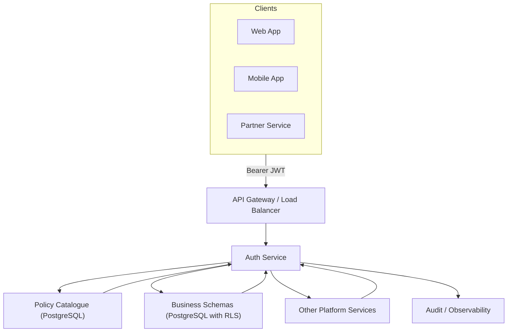

# Auth Platform Architecture

**Navigation:** Start here → Next: [Data Map](data-map.md)

This document gives you the birds-eye view of how the auth service keeps payment reconciliation safe. Think of it as the control tower diagram before you dive into the step-by-step flight plan.

## System Topology



- **API Gateway** – terminates TLS, enforces coarse routing, forwards only authenticated traffic.
- **Auth Service** – validates tokens, resolves roles/policies, sets database context, and returns a decision.
- **Policy Catalogue** – PostgreSQL tables storing roles, policies, endpoint bindings, and UI permissions.
- **Business Schemas** – Payment and employer data protected by row-level security (RLS).
- **Audit Layer** – Logs why access was granted or denied for compliance and debugging.

## Authentication Components

1. **Identity Provider (IdP)** issues JWTs after credential checks.
2. **Auth Service** verifies signatures and expirations using the shared secret/public key.
3. **Token Cache** (optional) accelerates repeat validations.
4. **Audit Hooks** record login success/failure for monitoring.

Key questions answered here: *Is the caller who they claim to be?* and *Is the token still valid?*

## Authorization Components

### Backend Security (API Authorization)
1. **Role Resolution** – `auth.user_roles` links users to their assigned roles.
2. **Policy Selection** – `auth.endpoint_policies` matches the HTTP method+path to policies.
3. **Policy Enforcement** – Authorization passes when the caller owns at least one required policy.
4. **Endpoint Protection** – Uncatalogued endpoints fail closed; only registered routes can execute.

### Frontend Visibility (UI Authorization)
1. **Page Actions** – `auth.page_actions` define UI buttons/actions and reference the backing endpoint.
2. **UI Matrix APIs**
   - `/api/meta/endpoints?page_id={id}` lists endpoints/actions wired to a page.
   - `/api/meta/ui-access-matrix/{page_id}` emits the full page → action → endpoint matrix (admin review).
   - `/api/meta/user-access-matrix/{user_id}` shows user → role → policy → endpoint chains for troubleshooting.
3. **Dynamic UI** – Frontend shows/hides buttons based on policies returned by `/api/me/authorizations`.

### Dual Relationship Model
```
Backend Authorization:
User → Role → Policy → Endpoint (via endpoint_policies)

Frontend UI Binding:
PageAction → Endpoint (API call target + metadata)
```

**Key Insight:** `page_actions` serves dual purpose:
- `endpoint_id`: Determines which API to call when the control is activated
- Presentational metadata (`label`, `variant`, etc.) decides how the control renders

Only when both policy enforcement and page action lookup succeed does the action complete.

## Request Lifecycle Snapshot

```mermaid
sequenceDiagram
    participant Client
    participant Gateway
    participant AuthService
    participant PolicyDb as "Policy Catalogue"
    participant DataDb as "PostgreSQL (RLS)"

    Client->>Gateway: HTTP request + JWT
    Gateway->>AuthService: Forward request
    AuthService->>AuthService: Validate JWT signature & expiry
    AuthService->>PolicyDb: Load roles & policies
    PolicyDb-->>AuthService: Policies + tenant rules
    AuthService->>PolicyDb: Check endpoint_policies
    AuthService->>DataDb: SELECT auth.set_user_context(user_id)
    AuthService->>DataDb: Execute business query
    DataDb-->>AuthService: Rows filtered by RLS
    AuthService-->>Client: 200 / 403 / 404
````

- **200 OK** – Policy and RLS checks pass.
- **403 Forbidden** – Policy check fails (user lacks required policy).
- **404 Not Found** – Data exists but RLS hides it (to prevent leaking existence).

## Operational Guardrails

- **Stateless JWT validation** keeps auth service horizontally scalable.
- **Database transactions** must set user context before touching tenant-protected tables.
- **Audit trails** ensure every decision can be reconstructed.
- **Legacy deep dives** remain in `../reference/raw/` for exhaustive tables and historical docs.

## Up Next

Continue to [Data Map](data-map.md) for entity relationships. Then explore these visual guides:

- **[Request Lifecycle Flowchart](request-lifecycle.md)** – See how requests flow through decision points
- **[Policy Binding Relationships](policy-binding.md)** – Understand how roles, policies, and endpoints connect
- **[Common Permission Patterns](permission-patterns.md)** – Learn real-world setup patterns

Finally, proceed to [Journey: Login To Data](../guides/login-to-data.md) for an end-to-end walkthrough.

````
