# Policy Binding Relationships

**Navigation:** Previous: [Request Lifecycle](request-lifecycle.md) → Next: [Common Permission Patterns](permission-patterns.md)

The capability layer has been retired. Authorization is now a three-hop chain:

```
User → Role → Policy → Endpoint
```

This note walks through each binding and shows how UI visibility stays aligned with backend enforcement. For the migration timeline see `auth-service/CAPABILITY_REMOVAL_CONTEXT.md`.

## The Three Binding Layers

### 1. Role ↔ Policy Binding
Roles activate policies by way of the `auth.role_policies` junction table.

```mermaid
graph TD
    R1["👤 Role: EMPLOYEE"] --> P1["📋 Policy: EMPLOYEE_POLICY"]
    R1 --> P2["📋 Policy: VIEWER_POLICY"]
    
    R2["👤 Role: MANAGER"] --> P2
    R2 --> P3["📋 Policy: MANAGER_POLICY"]
    
    R3["👤 Role: ADMIN"] --> P1
    R3 --> P2
    R3 --> P3
    R3 --> P4["📋 Policy: ADMIN_POLICY"]
    
    style P1 fill:#e1f5ff
    style P2 fill:#e1f5ff
    style P3 fill:#fff3e0
    style P4 fill:#ffebee
```



```sql
-- Debug: Which policies are active for a user?
SELECT 
  u.username,
  r.name  AS role,
  p.name  AS policy,
  rp.is_active AS policy_active
FROM auth.users u
LEFT JOIN auth.user_roles    ur ON u.id = ur.user_id
LEFT JOIN auth.roles         r  ON ur.role_id = r.id
LEFT JOIN auth.role_policies rp ON r.id = rp.role_id
LEFT JOIN auth.policies      p  ON rp.policy_id = p.id
WHERE u.username = 'worker.demo@lbe.local'
ORDER BY r.name, p.name;
```

---

### 2. Policy ↔ Endpoint Binding
Permission checks happen when the caller’s policies intersect with the policies required by an endpoint (`auth.endpoint_policies`).

```mermaid
graph TD
    E1["🔌 GET /api/payments"] --> P1["📋 VIEWER_POLICY"]
    E1 --> P2["📋 EMPLOYEE_POLICY"]
    
    E2["🔌 POST /api/payments"] --> P2
    E2 --> P3["📋 ADMIN_POLICY"]
    
    E3["🔌 DELETE /api/payments/:id"] --> P3
    
    E4["🔌 GET /api/reports"] --> P1
    
    style E1 fill:#f3e5f5
    style E2 fill:#f3e5f5
    style E3 fill:#f3e5f5
    style E4 fill:#f3e5f5
    style P1 fill:#e1f5ff
    style P2 fill:#e1f5ff
    style P3 fill:#ffebee
```



```sql
-- Endpoint policy catalogue
SELECT e.method, e.path, p.name AS policy
FROM auth.endpoint_policies ep
JOIN auth.endpoints e ON ep.endpoint_id = e.id
JOIN auth.policies p  ON ep.policy_id = p.id
ORDER BY e.method, e.path;
```

---

### 3. UI Binding (Page Actions ↔ Endpoints)
UI visibility is derived from the same endpoint catalogue. `auth.page_actions` stores the endpoint ID, and the SPA hydrates the UI via:

- `/api/meta/pages`
- `/api/meta/endpoints?page_id={pageId}`
- `/api/meta/ui-access-matrix/{pageId}`

```mermaid
graph TD
    UI1["🎨 Page: Payment Dashboard"] --> A1["🎯 Action: View Details"]
    A1 --> E1["🔌 GET /api/payments/{id}"]

    UI2["🎨 Page: Payment Dashboard"] --> A2["🎯 Action: Delete Payment"]
    A2 --> E2["🔌 DELETE /api/payments/{id}"]

    UI3["🎨 Page: Upload Center"] --> A3["🎯 Action: Upload CSV"]
    A3 --> E3["🔌 POST /api/payments/import"]

    style UI1 fill:#e8f5e9
    style UI2 fill:#e8f5e9
    style UI3 fill:#e8f5e9
```



```sql
-- Page actions wired to endpoints
SELECT 
  pa.page_id,
  pa.action,
  e.method,
  e.path
FROM auth.page_actions pa
JOIN auth.endpoints e ON pa.endpoint_id = e.id
WHERE pa.page_id = 2   -- e.g. "User Management"
  AND pa.is_active = true;
```

---

## Permission Matrix Example

| User | Roles | Policies | Can Call |
|------|-------|----------|----------|
| **alice** | EMPLOYEE | EMPLOYEE_POLICY, VIEWER_POLICY | GET/POST `/api/payments`, GET `/api/reports` |
| **bob** | MANAGER | MANAGER_POLICY, VIEWER_POLICY | alice’s endpoints + POST `/api/payments/approve` |
| **charlie** | ADMIN | ADMIN_POLICY | All admin and reporting endpoints |

| Endpoint | Required Policies | alice | bob | charlie |
|----------|-------------------|-------|-----|---------|
| GET /api/payments | VIEWER_POLICY OR EMPLOYEE_POLICY | ✅ | ✅ | ✅ |
| POST /api/payments | EMPLOYEE_POLICY | ✅ | ✅ | ✅ |
| POST /api/payments/approve | MANAGER_POLICY | ❌ | ✅ | ✅ |
| DELETE /api/payments/:id | ADMIN_POLICY | ❌ | ❌ | ✅ |
| GET /api/reports | VIEWER_POLICY | ✅ | ✅ | ✅ |
| POST /api/admin/roles | ROLE_MANAGE_POLICY | ❌ | ❌ | ✅ |

---

## Key Takeaways

1. Policies are the single source of truth; roles simply aggregate them.
2. Endpoint registration must stay in lockstep with policy assignments; uncatalogued endpoints fail closed.
3. UI elements derive from endpoint metadata rather than capability tables, keeping visibility and enforcement aligned.
4. Keep an eye on `CAPABILITY_REMOVAL_CONTEXT.md` for outstanding cleanup steps (SQL migrations, legacy references, etc.).
