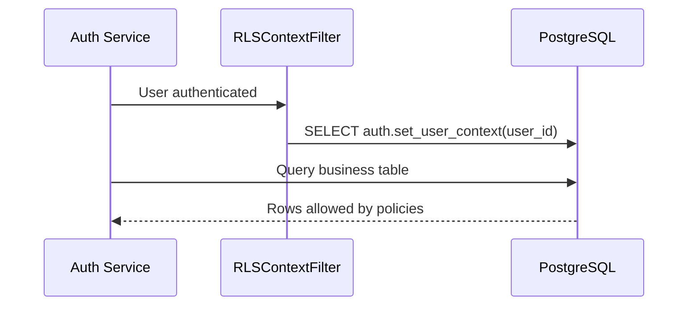

# Data Guardrails 101

**Optional Primer:** Use this with [Journey: Login To Data](../guides/login-to-data.md) and before following the VPD playbook in [VPD Setup Playbook](../guides/setup/vpd.md).

Row-level security (RLS) is how we make sure every request only sees the data it should. Think of it as a hotel elevator controlled by keycards.

## Hotel Elevator Analogy

- Every guest receives a keycard (their user ID and tenant assignments).
- When the elevator panel is unlocked, you see buttons for every floor.
- Pressing a floor you’re not allowed on simply does nothing.
- Staff have keycards that open more floors.

In our platform:

- **Guests** = Users making API calls.
- **Keycard** = `auth.set_user_context(user_id)` which loads tenant permissions.
- **Elevator panel** = SQL queries the service executes.
- **Floors** = Rows in tenant-specific tables.

## How RLS Works

1. After authentication, the service calls `auth.set_user_context(user_id)`.
2. PostgreSQL loads the user’s tenant assignments into the session.
3. RLS policies attached to tables filter rows automatically.

## Real-Life Scenario: Worker Views Payslip

- Worker logs in; their keycard includes `board_id = BOARD_1`, `employer_id = EMP_21`.
- Query asks for payslips from the entire table.
- RLS policy ensures only rows matching `(BOARD_1, EMP_21)` are returned.
- The worker never sees other employers’ data, even if the endpoint is misconfigured.

## Key Ingredients

| Table / Function | Purpose | Analogy |
| --- | --- | --- |
| `auth.user_tenant_acl` | Maps users to the tenants they can see | Hotel registry |
| `auth.set_user_context(user_id)` | Loads tenant list into the session | Keycard swipe |
| RLS policies on data tables | Enforce the filter | Elevator logic |
| Database roles (`app_auth`, `app_payment_flow`) | Control which schemas can be touched | Staff vs guest access |

## Checklist Before You Trust RLS

1. Run `ONBOARDING/setup/08_configure_vpd.sql` to install policies.
2. Verify every data table has the tenant columns (`board_id`, `employer_id`).
3. Set the user context in tests (`SELECT auth.set_user_context('user-id');`).
4. Use application roles—not database superusers—when verifying behaviour.
5. Read the quick checks in `reference/vpd-checklist.md` for questions to ask when something looks off.

## Common Pitfalls & Fixes

- **Seeing all rows when testing:** You’re likely connected as a superuser. Switch to `SET ROLE app_payment_flow`.
- **Seeing no rows despite valid data:** Your ACL entry is missing. Populate `auth.user_tenant_acl`.
- **Users seeing too much:** Audit ACL entries and confirm the `set_user_context` call happens before queries.

## Where To Go Next

- `guides/verify-permissions.md` – Smoke tests for RLS and RBAC combined.
- `playbooks/troubleshoot-auth.md` – Symptom-based fixes for visibility issues.
- `reference/vpd-checklist.md` – Quick answers for production reviews.
