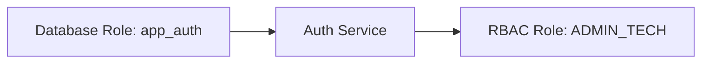

# PostgreSQL For Auth Engineers

**Optional Primer:** Review this before running the setup scripts in [RBAC Setup Playbook](../guides/setup/rbac.md) and [VPD Setup Playbook](../guides/setup/vpd.md).

PostgreSQL is more than a database here—it acts like the secure vault governing who can see what. This primer explains the pieces you’ll touch without expecting deep DBA knowledge.

## Picture A Bank Vault

- **Vault rooms** hold different ledgers (schemas like `auth` and `payment_flow`).
- **Vault staff** each have a different master key (database roles such as `app_auth`, `app_payment_flow`).
- **Security logs** track who opens which room (audit tables).
- **Laser grids** stop intruders (RLS policies).

You don’t need to be the locksmith, but you do need to know which key opens which door.

## Schemas You’ll Care About

| Schema | What’s Inside | Why It Matters |
| --- | --- | --- |
| `auth` | Roles, policies, capabilities, mappings, tenant ACL | Source of truth for RBAC decisions |
| `payment_flow` | Payment requests, worker uploads, employer approvals | Data protected by RLS |
| `audit` | Action logs, policy updates, login events | Trail of evidence for reviews |

## Database Roles (Different From RBAC Roles!)

- **Database roles** control *which tables* the application code can touch.
- **RBAC roles** control *which actions* an end user can take.
- The onboarding scripts grant the application roles the minimum privileges needed to enforce RLS while keeping admin tasks separate.

## Operational Tasks You’ll Perform

1. **Run setup scripts** from `../ONBOARDING/setup/` to create tables, policies, and seed data.
2. **Apply migrations** for new capabilities or schema changes using the same database role the service uses.
3. **Inspect ACL data** with read-only queries when debugging access.
4. **Review logs** to ensure policy changes are audited.

## Example Workflow: Adding A New Capability

1. Update the capability catalogue (usually via migration) to add `payment.ledger.download`.
2. Link the capability to the right policy (`auth.policy_capability`).
3. Associate the endpoint in `auth.endpoint_policy`.
4. Deploy the migration and restart the service so caches refresh.
5. Validate with `SELECT * FROM auth.policy_capability WHERE capability = 'payment.ledger.download';`

## Health Checks & Monitoring

- Use `guides/verify-permissions.md` for smoke tests combining RBAC and RLS.
- Monitor `pg_stat_activity` to ensure sessions call `auth.set_user_context` early.
- Keep an eye on `audit.policy_change_log` to spot unexpected tweaks.

## Where To Learn More

- Deep DBA notes remain in `reference/raw/POSTGRES/`.
- `reference/postgres-operations.md` summarises the operational checklist.
- Ask your DBA counterpart before running ad-hoc scripts in production; many tasks have existing playbooks for safety.
