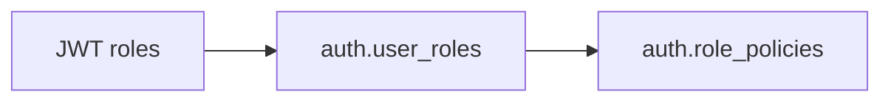
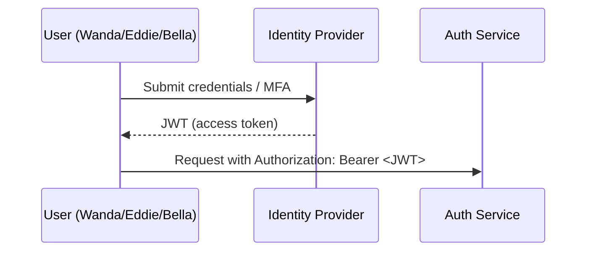
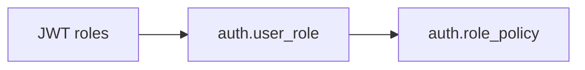
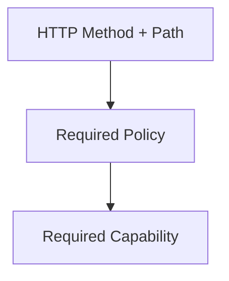
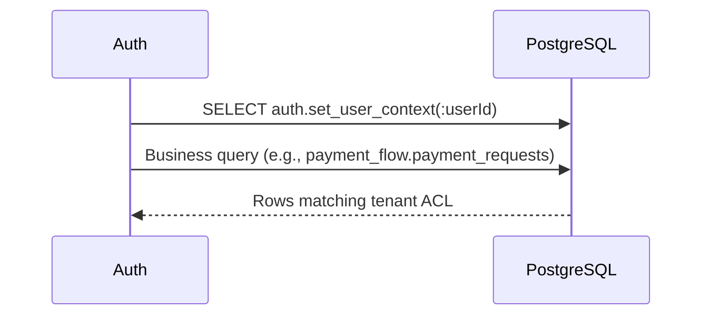

# Journey: Login To Data

**Navigation:** Previous## Step 2 – Resolve Roles & Policies



- Wanda's token lists `WORKER`, Eddie's lists `EMPLOYER`, Bella's lists `BOARD`.
- The service loads additional role assignments from `auth.user_roles` (useful for service accounts or secondary roles).
- Each role activates one or more policies via the `auth.role_policies` junction table (e.g., `EMPLOYER` → `EMPLOYER_POLICY`)./architecture/data-map.md) → Next: [RBAC Setup Playbook](setup/rbac.md)

Walk through the entire experience of a user hitting the platform, from login to seeing their data. Meet our three tour guides:

- **Wanda Worker** – uploads documents and checks her own status.
- **Eddie Employer** – reviews and approves requests submitted by workers in his organisation.
- **Bella Board** – signs off on large payouts across every employer.

## Step 1 – Sign In & Issue JWT



### JWT Anatomy

```json
{
  "iss": "https://idp.lbe.local",
  "sub": "wanda.worker",
  "uid": 1042,
  "roles": ["WORKER"],
  "pv": 7,
  "iat": 1730355600,
  "exp": 1730359200,
  "jti": "b7d2d8e6-..."
}
```

- `roles` contains the RBAC roles assigned to the user.
- `pv` (permission version) increments whenever capabilities change; cached decisions can be invalidated.
- `jti` allows revoking a token early if needed.

The auth service verifies:

1. Signature matches the configured public key.
2. Token is unexpired (`exp`).
3. Token is not revoked (optional cache lookup).

If any check fails, the service sends `401 Unauthorized`.

## Step 2 – Resolve Roles & Policies



- Wanda’s token lists `WORKER`, Eddie’s lists `EMPLOYER`, Bella’s lists `BOARD`.
- The service loads additional role assignments from `auth.user_role` (useful for service accounts or secondary roles).
- Each role activates one or more policies via `auth.role_policy` (e.g., `EMPLOYER` → `EMPLOYER_POLICY`).

## Step 3 – Match Endpoint Requirements



1. The controller or route advertises the required capability (e.g., `payment.details.read`).
2. `auth.endpoint_policies` reveals which policy guards the route.
3. `auth.policy_capabilities` confirms the policy carries the required capability.

### Persona Snapshot

| Persona | Endpoint | Capability Needed | Outcome |
| --- | --- | --- | --- |
| Wanda Worker | `GET /api/worker/payments/:id` | `payment.details.read` | Allowed by WORKER policy |
| Eddie Employer | `POST /api/employer/approvals` | `payment.approval.submit` | Allowed by EMPLOYER policy |
| Bella Board | `GET /api/board/summary` | `board.summary.read` | Allowed by BOARD policy |

If the capability is missing, the service returns `403 Forbidden`.

## Step 4 – Shape The UI Experience

- After login, the front-end calls `/api/me/authorizations`.
- The response includes roles, capabilities, UI pages, and actions.
- Components hide buttons or entire pages unless the capability list contains the required entry.

Example response fragment for Eddie:

```json
{
  "roles": ["EMPLOYER"],
  "capabilities": [
    "payment.details.read",
    "payment.approval.submit",
    "ui.page.employer.dashboard.view"
  ],
  "uiActions": [
    "ui.action.employer.approval.click"
  ]
}
```

This ensures Eddie sees the “Approve” button while Wanda does not.

## Step 5 – Apply Row-Level Security (RLS)



- `auth.set_user_context` loads tenant assignments from `auth.user_tenant_acl`.
- Wanda’s ACL restricts results to her worker ID.
- Eddie’s ACL grants rows for his employer.
- Bella’s ACL typically covers all boards/employers, so she sees everything.

If tenant data is missing or incorrect, RLS may return zero rows, leading to a `404` from the API even though the record exists.

## Step 6 – Audit The Decision

- Each access attempt logs the principal, endpoint, decision, and reason.
- Audit trails live in dedicated tables (see `../reference/raw/POSTGRES/` for full schema).
- Useful for compliance and debugging unexpected 403/404 outcomes.

## Ready To Build?

You now know the journey from login to data access. Continue to [RBAC Setup Playbook](setup/rbac.md) to learn how to create roles, policies, capabilities, endpoints, and UI bindings in the correct order.
