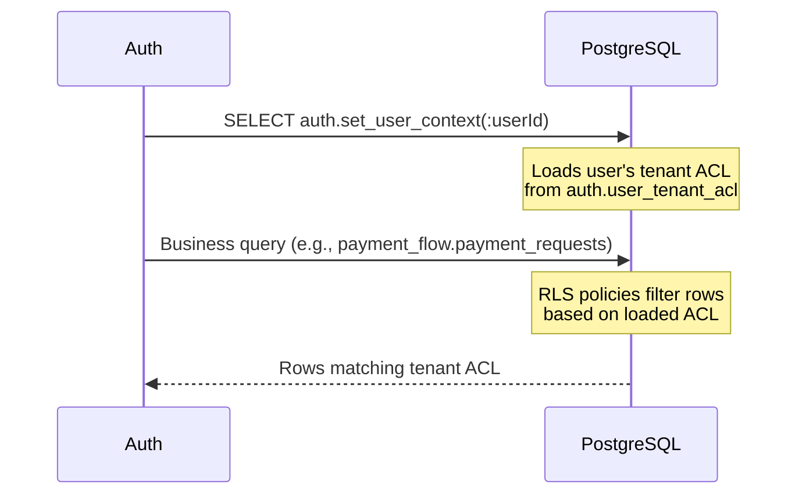
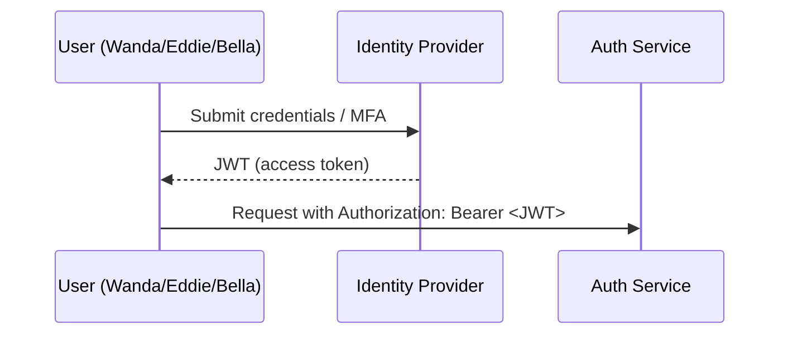
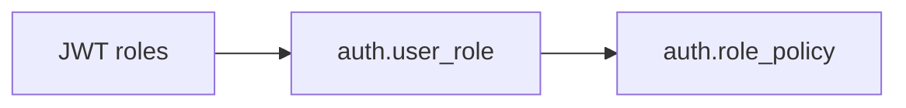
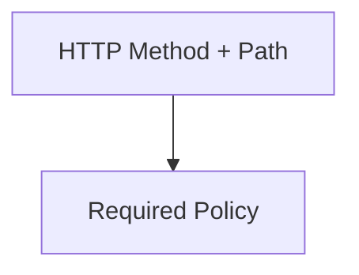
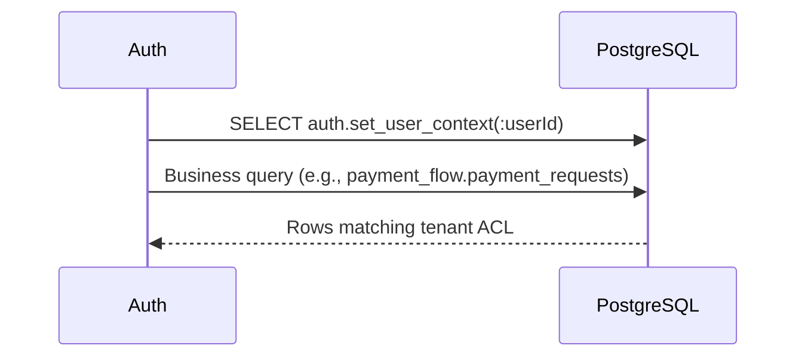

# Journey: Login To Data

**Navigation:** Previous: [Data Map](../architecture/data-map.md) → Next: [RBAC Setup Play## Step 5 – Apply Row-Level Security (RLS)



- After JWT validation, the service extracts `uid` (user ID) from the token.
- `auth.set_user_context(uid)` queries `auth.user_tenant_acl` and loads the user's allowed (board_id, employer_id) pairs into the PostgreSQL session.
- Wanda's ACL restricts results to her worker ID and employer.
- Eddie's ACL grants rows for his employer's data.
- Bella's ACL typically covers all boards/employers, so she sees everything.
- **Critical:** Tenant information is NOT in the JWT—it's dynamically loaded from the database for each request.

If tenant data is missing or incorrect in `auth.user_tenant_acl`, RLS may return zero rows, leading to a `404` from the API even though the record exists in the table.d)

Walk through the entire experience of a user hitting the platform, from login to seeing their data. Meet our three tour guides:

- **Wanda Worker** – uploads documents and checks her own status.
- **Eddie Employer** – reviews and approves requests submitted by workers in his organisation.
- **Bella Board** – signs off on large payouts across every employer.

## Step 1 – Sign In & Issue JWT



### JWT Anatomy

```json
{
  "iss": "payment-reconciliation-service",
  "sub": "wanda.worker",
  "aud": "payment-reconciliation-api",
  "jti": "b7d2d8e6-...",
  "uid": 1042,
  "pv": 1,
  "iat": 1730355600,
  "exp": 1730359200
}
```

- `uid` (user ID) identifies the authenticated user.
- `pv` (permission version) tracks policy changes; incremented when user's role/policy assignments change.
- `sub` (subject) contains the username.
- `jti` (JWT ID) allows revoking a token early if needed.
- **Important:** JWT does NOT contain roles or tenant information. These are resolved server-side from database tables after token validation.

The auth service verifies:

1. Signature matches the configured secret key.
2. Token is unexpired (`exp`).
3. Issuer (`iss`) and audience (`aud`) match expected values.
4. Token is not revoked (optional cache lookup using `jti`).

If any check fails, the service sends `401 Unauthorized`.

## Step 2 – Resolve Roles & Policies



- Wanda’s token lists `WORKER`, Eddie’s lists `EMPLOYER`, Bella’s lists `BOARD`.
- The service loads additional role assignments from `auth.user_role` (useful for service accounts or secondary roles).
- Each role activates one or more policies via `auth.role_policy` (e.g., `EMPLOYER` → `EMPLOYER_POLICY`).

## Step 3 – Match Endpoint Requirements



1. The controller or route advertises the required policy (e.g., `EMPLOYER_POLICY`).
2. `auth.endpoint_policies` reveals which policy guards the route.
3. The access layer checks the user's resolved policies before letting the request through.

### Persona Snapshot

| Persona        | Endpoint                       | Policy Needed     | Outcome                    |
| -------------- | ------------------------------ | ----------------- | -------------------------- |
| Wanda Worker   | `GET /api/worker/payments/:id` | `WORKER_POLICY`   | Allowed by WORKER_POLICY   |
| Eddie Employer | `POST /api/employer/approvals` | `EMPLOYER_POLICY` | Allowed by EMPLOYER_POLICY |
| Bella Board    | `GET /api/board/summary`       | `BOARD_POLICY`    | Allowed by BOARD_POLICY    |

If the policy is missing, the service returns `403 Forbidden`.

## Step 4 – Shape The UI Experience

- After login, the front-end calls `/api/me/authorizations`.
- The response includes roles, policies, UI pages, and actions.
- Components hide buttons or entire pages unless the policy list contains the required entry.

Example response fragment for Eddie:

```json
{
  "roles": ["EMPLOYER"],
  "policies": ["EMPLOYER_POLICY", "EMPLOYER_UI"],
  "uiActions": ["ui.action.employer.approval.click"]
}
```

This ensures Eddie sees the “Approve” button while Wanda does not.

## Step 5 – Apply Row-Level Security (RLS)



- `auth.set_user_context` loads tenant assignments from `auth.user_tenant_acl`.
- Wanda’s ACL restricts results to her worker ID.
- Eddie’s ACL grants rows for his employer.
- Bella’s ACL typically covers all boards/employers, so she sees everything.

If tenant data is missing or incorrect, RLS may return zero rows, leading to a `404` from the API even though the record exists.

## Step 6 – Audit The Decision

- Each access attempt logs the principal, endpoint, decision, and reason.
- Audit trails live in dedicated tables (see `../reference/raw/POSTGRES/` for full schema).
- Useful for compliance and debugging unexpected 403/404 outcomes.

## Ready To Build?

You now know the journey from login to data access. Continue to [RBAC Setup Playbook](setup/rbac.md) to learn how to create roles, policies, endpoints, and UI bindings in the correct order.
