# Request Lifecycle & Decision Points

**Navigation:** Previous: [Journey: Login To Data](login-to-data.md) → Next: [RBAC Setup Playbook](setup/rbac.md)

This guide shows how a request flows through the auth service from initial HTTP call through final data access, with every decision point highlighted.

## High-Level Lifecycle

```mermaid
graph TD
    A["🔵 User Requests<br/>GET /api/payment-ledger"] --> B["🔐 Step 1: Validate JWT<br/>Extract user_id, roles"]
    B -->|Invalid Token| E["❌ 401 Unauthorized"]
    B -->|Valid Token| C["🎯 Step 2: Load User Context<br/>Get roles → policies"]
    C -->|User Disabled| F["❌ 403 Forbidden"]
    C -->|Roles Found| D["🔍 Step 3: Check Endpoint Guard<br/>Does endpoint require auth?"]
    D -->|Public Endpoint| G["✅ Access Granted<br/>Return all data"]
    D -->|Protected Endpoint| H["🔒 Step 4: Match Policy<br/>Does user have required policy?"]
    H -->|No Policy| I["❌ 403 Forbidden"]
    H -->|Has Policy| J["🗂️ Step 5: Apply RLS<br/>Filter rows by tenant_acl"]
    J --> K["📊 Step 6: Execute Query<br/>Return filtered data"]
    K --> L["✅ 200 OK<br/>Response sent"]
    L --> M["📝 Step 7: Audit Log<br/>Record: user, action, resource, result"]
    
    style A fill:#e1f5ff
    style E fill:#ffcdd2
    style F fill:#ffcdd2
    style I fill:#ffcdd2
    style G fill:#c8e6c9
    style L fill:#c8e6c9
    style M fill:#fff9c4
```



## Detailed Decision Points

### 🔐 Step 1: JWT Validation

**What happens:**
- HTTP request arrives with `Authorization: Bearer <jwt>`
- JWT is decoded and verified against signing key
- User ID and role assignments are extracted from token claims

**Database checks:**
```sql
SELECT u.id, u.username, u.status, 
       array_agg(r.name) as roles
FROM auth.users u
LEFT JOIN auth.user_roles ur ON u.id = ur.user_id
LEFT JOIN auth.roles r ON ur.role_id = r.id
WHERE u.id = $1 AND u.status = 'ACTIVE'
GROUP BY u.id;
```

**Decision:**
- ✅ **Valid & Active User** → Proceed to Step 2
- ❌ **Invalid Token** → 401 Unauthorized
- ❌ **Expired Token** → 401 Unauthorized
- ❌ **User Disabled** → 403 Forbidden

---

### 🎯 Step 2: Load User Context

**What happens:**
- Roles are looked up from token
- Each role is matched to its policies
- Policies are loaded into context for authorization checks

**Database checks:**
```sql
SELECT DISTINCT p.id, p.name
FROM auth.users u
JOIN auth.user_roles ur ON u.id = ur.user_id
JOIN auth.roles r ON ur.role_id = r.id
JOIN auth.role_policies rp ON r.id = rp.role_id
JOIN auth.policies p ON rp.policy_id = p.id
WHERE u.id = $1 AND r.is_active = true AND p.is_active = true;
```

**Decision:**
- ✅ **Policies Loaded** → Proceed to Step 3
- ❌ **No Roles Assigned** → 403 Forbidden
- ❌ **All Policies Disabled** → 403 Forbidden

---

### 🔍 Step 3: Check Endpoint Registration

**What happens:**
- Endpoint method + path is looked up in `auth.endpoints`
- Determines if endpoint requires authentication
- Determines which policies are required

**Database check:**
```sql
SELECT e.id, e.method, e.path, e.is_public,
       array_agg(p.name) as required_policies
FROM auth.endpoints e
LEFT JOIN auth.endpoint_policies ep ON e.id = ep.endpoint_id
LEFT JOIN auth.policies p ON ep.policy_id = p.id
WHERE e.method = $1 AND e.path ILIKE $2;
```

**Decision:**
- ✅ **Public Endpoint** → Skip to Step 6 (execute query)
- ✅ **Protected Endpoint Found** → Proceed to Step 4
- ⚠️ **Endpoint Not Registered** → Default to protected (safe fail)

---

### 🔒 Step 4: Match Required Policy

**What happens:**
- Endpoint specifies required policies
- User's loaded policies are checked against requirement
- Uses intersection: user_policies ∩ required_policies

**Logic:**
```java
Set<String> userPolicyNames = userPolicies.stream()
    .map(Policy::getName)
    .collect(Collectors.toSet());

boolean hasAccess = requiredPolicies.stream()
    .anyMatch(userPolicyNames::contains);

if (!hasAccess) {
    // Log the denial
    auditLog.record(userId, "POLICY_CHECK_FAILED", 
                   endpoint, requiredPolicies);
    return new ResponseEntity<>(HttpStatus.FORBIDDEN);
}
```

**Decision:**
- ✅ **User Has At Least One Required Policy** → Proceed to Step 5
- ❌ **User Missing All Required Policies** → 403 Forbidden (log denial)

---

### 🗂️ Step 5: Apply Row-Level Security (RLS)

**What happens:**
- VPD (Virtual Private Database) policies are applied
- `auth.set_user_context()` sets session user_id
- Query predicates automatically restrict rows
- User sees only data matching their tenant_acl

**Database setup:**
```sql
-- VPD Policy on payment records
CREATE POLICY tenant_isolation_policy ON payments
  USING (
    employer_id IN (
      SELECT employer_id FROM auth.user_tenant_acl 
      WHERE user_id = current_user_id
    )
  );
```

**Decision:**
- ✅ **User Has Tenant Access** → Proceed to Step 6
- ⚠️ **No Matching Tenant Rows** → Return empty result set (not an error)

---

### 📊 Step 6: Execute Query & Return Data

**What happens:**
- Query executes with VPD policies active
- Only rows matching user's tenant scope are returned
- Response is serialized and sent

**Example:**
```sql
SET ROLE app_auth;
SELECT auth.set_user_context('user-123'::uuid);

-- This now returns only rows for user's employers
SELECT * FROM payments WHERE status = 'PENDING';
```

**Decision:**
- ✅ **Query Successful** → 200 OK with data
- ⚠️ **Query Returns Empty Set** → 200 OK with empty array (not an error)
- ❌ **Query Error** → 500 Internal Server Error (+ audit log)

---

### 📝 Step 7: Audit Logging

**What happens:**
- Every decision (allow/deny) is logged
- Includes: user_id, timestamp, resource, action, result
- Used for compliance, debugging, and security analysis

**Audit table:**
```sql
INSERT INTO auth.audit_log (user_id, action, resource_type, 
                           resource_id, decision, timestamp)
VALUES ($1, $2, $3, $4, $5, NOW());
```

**Examples:**
- ✅ ALLOWED: user.id=123, action=GET, resource=/api/payment/456, result=OK
- ❌ DENIED: user.id=123, action=GET, resource=/api/admin/users, result=POLICY_MISSING
- ❌ DENIED: user.id=123, action=GET, resource=/api/payment/999, result=TENANT_MISMATCH (RLS blocked)

---

## Request Scenarios

### Scenario 1: Worker Views Own Payment Status

```
Request: GET /api/workers/123/status

Step 1: JWT Valid ✅ (user_id=worker.demo, roles=[WORKER])
Step 2: Load Context ✅ (policies=[WORKER_POLICY])
Step 3: Endpoint Check ✅ (Protected, requires WORKER_POLICY)
Step 4: Policy Match ✅ (user HAS WORKER_POLICY)
Step 5: RLS Filter ✅ (user's employer_id=5, row matches)
Step 6: Query ✅ (returns payment record)
Step 7: Audit ✅ (logged: ALLOWED)

Result: 200 OK with payment data
```

### Scenario 2: Worker Tries to Access Admin Panel

```
Request: GET /api/admin/users

Step 1: JWT Valid ✅ (user_id=worker.demo, roles=[WORKER])
Step 2: Load Context ✅ (policies=[WORKER_POLICY])
Step 3: Endpoint Check ✅ (Protected, requires ADMIN_POLICY)
Step 4: Policy Match ❌ (user LACKS ADMIN_POLICY)
Step 5: (Skipped - auth failed)
Step 6: (Skipped - auth failed)
Step 7: Audit ✅ (logged: DENIED - POLICY_MISSING)

Result: 403 Forbidden
```

### Scenario 3: Employer Views Worker in Different Organization

```
Request: GET /api/workers/999/profile
Headers: Assume user_id=employer-acme, role=[EMPLOYER]

Step 1: JWT Valid ✅ (user_id=employer.acme)
Step 2: Load Context ✅ (policies=[EMPLOYER_POLICY])
Step 3: Endpoint Check ✅ (Protected, requires EMPLOYER_POLICY)
Step 4: Policy Match ✅ (user HAS EMPLOYER_POLICY)
Step 5: RLS Filter ❌ (worker.id=999 belongs to employer_globex, not acme)
Step 6: Query ✅ (returns empty result - VPD filtered it out)
Step 7: Audit ⚠️ (logged: ALLOWED_NO_DATA - RLS restricted)

Result: 200 OK with empty result (not an error, but empty)
```

### Scenario 4: Public Endpoint (No Auth)

```
Request: GET /api/health

Step 1: (Skipped - public endpoint)
Step 2: (Skipped - public endpoint)
Step 3: Endpoint Check ✅ (Public, no auth required)
Step 4-5: (Skipped - no auth needed)
Step 6: Query ✅ (returns health status)
Step 7: Audit ⚠️ (may not log, or minimal logging)

Result: 200 OK with health data
```

---

## Key Takeaways

1. **Defense in Depth** - Multiple layers (JWT → Policy → RLS) ensure no single failure opens access
2. **Fail Secure** - Unknown endpoints default to protected; missing policies default to denied
3. **Audit Everything** - Every decision (allow/deny) is recorded for compliance and troubleshooting
4. **RLS Is the Final Word** - Even if policy check passes, VPD ensures wrong tenant data is never returned
5. **No Silent Failures** - Empty result sets are allowed but logged; query errors become 500s

---

## Decision Matrix Reference

| Step | Condition | Decision | HTTP Status |
|------|-----------|----------|-------------|
| 1 | Invalid/Expired JWT | Deny | 401 |
| 1 | User disabled | Deny | 403 |
| 2 | No roles assigned | Deny | 403 |
| 3 | Endpoint not found | Deny | 404 |
| 4 | Missing required policy | Deny | 403 |
| 5 | Tenant/RLS mismatch | Allow (empty data) | 200 |
| 6 | Query error | Error | 500 |

---

## Next Steps

- Understand the data relationships in [Data Map](../architecture/data-map.md)
- Follow the complete journey in [Login To Data](login-to-data.md)
- Set up RBAC with [RBAC Setup Playbook](setup/rbac.md)
- Learn about VPD enforcement in [VPD Setup Playbook](setup/vpd.md)

