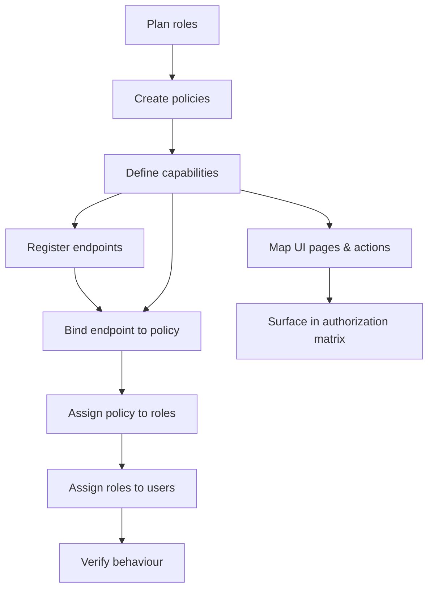

# RBAC Setup Playbook

**Navigation:** Previous: [Journey: Login To Data](../login-to-data.md) → Next: [VPD Setup Playbook](vpd.md)

Follow this sequence whenever you onboard a new tenant or extend permissions. Treat it like wiring a building’s security system—each step unlocks the next one.

## Overview Of The Flow



## 1. Plan Roles & Personas

- Confirm which personas exist (e.g., Worker, Employer, Board, Service Accounts).
- Decide whether new roles are needed or existing ones can be reused.
- Reference: `../../reference/role-catalog.md`.

## 2. Create Or Update Policies

Policies bundle capabilities and tie an endpoint to a set of roles.

**Via SQL:**
```sql
-- Insert a policy if it doesn't exist
INSERT INTO auth.policy (name, description)
VALUES ('EMPLOYER_POLICY', 'Employer actions for payment reconciliation')
ON CONFLICT (name) DO NOTHING;
```

**Via API (UI):**
```http
POST /api/admin/policies
Content-Type: application/json

{
  "name": "EMPLOYER_POLICY",
  "description": "Employer actions for payment reconciliation"
}
```

Link the policy to roles:

**Via SQL:**
```sql
INSERT INTO auth.role_policies (role_id, policy_id, assigned_at, is_active)
SELECT r.id, p.id, CURRENT_TIMESTAMP, true
FROM auth.roles r, auth.policies p
WHERE r.name IN ('EMPLOYER', 'TEST_USER')
  AND p.name = 'EMPLOYER_POLICY'
ON CONFLICT (role_id, policy_id) DO NOTHING;
```

**Via API (UI):**
```http
POST /api/admin/policies/{policyId}/roles
Content-Type: application/json

{
  "roleIds": [2, 3]
}
```
(where `roleIds` correspond to EMPLOYER and TEST_USER roles)

## 3. Define Capabilities

Use the `<domain>.<subject>.<action>` naming convention.

**Via SQL:**
```sql
INSERT INTO auth.capability (name, description)
VALUES ('payment.ledger.download', 'Download employer payment ledger CSV')
ON CONFLICT (name) DO NOTHING;
```

**Via API (UI):**
```http
POST /api/admin/capabilities
Content-Type: application/json

{
  "name": "payment.ledger.download",
  "description": "Download employer payment ledger CSV"
}
```

Map capabilities to the policy:

**Via SQL:**
```sql
INSERT INTO auth.policy_capability (policy_id, capability_id)
SELECT p.id, c.id
FROM auth.policy p, auth.capability c
WHERE p.name = 'EMPLOYER_POLICY'
  AND c.name = 'payment.ledger.download'
ON CONFLICT (policy_id, capability_id) DO NOTHING;
```

**Via API (UI):**
```http
POST /api/admin/policies/{policyId}/capabilities
Content-Type: application/json

{
  "capabilityIds": [12]
}
```
(where `capabilityIds` is the ID of the `payment.ledger.download` capability)

## 4. Register Endpoints

**Via SQL:**
```sql
INSERT INTO auth.endpoint (method, path, label)
VALUES ('GET', '/api/employer/payment-ledger', 'Download employer payment ledger')
ON CONFLICT (method, path) DO NOTHING;
```

**Via API (UI):**
```http
POST /api/admin/endpoints
Content-Type: application/json

{
  "method": "GET",
  "path": "/api/employer/payment-ledger",
  "label": "Download employer payment ledger"
}
```

Bind the endpoint to the policy:

**Via SQL:**
```sql
INSERT INTO auth.endpoint_policy (endpoint_id, policy_id)
SELECT e.id, p.id
FROM auth.endpoint e, auth.policy p
WHERE e.method = 'GET'
  AND e.path = '/api/employer/payment-ledger'
  AND p.name = 'EMPLOYER_POLICY'
ON CONFLICT (endpoint_id, policy_id) DO NOTHING;
```

**Via API (UI):**
```http
POST /api/admin/endpoints/{endpointId}/policies
Content-Type: application/json

{
  "policyIds": [5]
}
```
(where `endpointId` is the GET /api/employer/payment-ledger endpoint ID and `policyIds` contains EMPLOYER_POLICY ID)

## 5. Wire UI Pages & Actions

### Understanding page_actions Table
The `page_actions` table serves a **dual purpose**:
1. **Permission Check**: Links to `capability_id` to determine if user can see the action
2. **API Binding**: Links to `endpoint_id` to specify which endpoint to call

**Schema:**
```sql
CREATE TABLE auth.page_actions (
    id BIGSERIAL PRIMARY KEY,
    page_id INTEGER REFERENCES auth.ui_pages(id),
    label VARCHAR(64) NOT NULL,
    capability_id BIGINT REFERENCES auth.capabilities(id),
    endpoint_id BIGINT REFERENCES auth.endpoints(id),
    -- other fields...
);
```

### Frontend Authorization Flow
```
User loads page
  ↓
Call: GET /api/meta/endpoints?page_id={id}
  ↓
Backend returns page_actions WHERE:
  - user has the required capability_id
  - endpoint_id is not null
  ↓
Frontend renders buttons/actions with API endpoints
```

**Via SQL:**
```sql
-- Create page action with both capability and endpoint
INSERT INTO auth.page_actions (page_id, label, capability_id, endpoint_id)
SELECT 
    p.id,
    'Download Ledger',
    c.id,
    e.id
FROM auth.ui_pages p
CROSS JOIN auth.capabilities c
CROSS JOIN auth.endpoints e
WHERE p.page_id = 'EMPLOYER_DASHBOARD'
  AND c.name = 'payment.ledger.download'
  AND e.method = 'GET'
  AND e.path = '/api/employer/payment-ledger'
ON CONFLICT DO NOTHING;
```

**Via API (UI):**
```http
-- Create page action
POST /api/admin/page-actions
Content-Type: application/json

{
  "pageId": 5,
  "label": "Download Ledger",
  "capabilityId": 12,
  "endpointId": 45
}
```

### Verify Page Actions Linkage
```sql
-- Check complete authorization chain for a page
SELECT 
    pa.id,
    pa.label,
    c.name as capability,
    e.method,
    e.path,
    STRING_AGG(DISTINCT p.name, ', ') as policies
FROM auth.page_actions pa
JOIN auth.capabilities c ON pa.capability_id = c.id
JOIN auth.endpoints e ON pa.endpoint_id = e.id
JOIN auth.policy_capabilities pc ON c.id = pc.capability_id
JOIN auth.policies p ON pc.policy_id = p.id
WHERE pa.page_id = 2  -- User Management page
GROUP BY pa.id, pa.label, c.name, e.method, e.path
ORDER BY pa.id;
```

**Important:** Front-end code should:
1. Call `/api/meta/endpoints?page_id={id}` to get available actions
2. Only render buttons/actions returned in the response
3. Use the `endpoint` field to make API calls when clicked

## 6. Assign Roles To Users

**Via SQL:**
```sql
INSERT INTO auth.user_roles (user_id, role_id)
SELECT u.id, r.id
FROM auth.users u, auth.roles r
WHERE u.username = 'employer.demo'
  AND r.name = 'EMPLOYER'
ON CONFLICT (user_id, role_id) DO NOTHING;
```

**Via API (UI):**
```http
POST /api/admin/users/{userId}/roles
Content-Type: application/json

{
  "roleIds": [2]
}
```
(where `userId` is the ID of employer.demo user and `roleIds` contains EMPLOYER role ID)

If creating service accounts, ensure credentials are stored securely and tokens carry the correct audience.

## 7. Verify The Setup

### Backend Verification
1. **Test endpoint authorization** with both allowed and disallowed users (expect 200 vs 403):
```bash
# Allowed user
curl -H "Authorization: Bearer $ADMIN_TOKEN" 
  http://localhost:8080/api/auth/users

# Disallowed user
curl -H "Authorization: Bearer $BASIC_TOKEN" 
  http://localhost:8080/api/auth/users
```

2. **Check capability resolution**:
```sql
-- What capabilities does this user have?
SELECT DISTINCT c.name
FROM auth.user_roles ur
JOIN auth.roles r ON ur.role_id = r.id
JOIN auth.role_policies rp ON r.id = rp.role_id
JOIN auth.policies p ON rp.policy_id = p.id
JOIN auth.policy_capabilities pc ON p.id = pc.policy_id
JOIN auth.capabilities c ON pc.capability_id = c.id
WHERE ur.user_id = 123
  AND rp.is_active = true
  AND p.is_active = true;
```

3. **Verify endpoint-policy links**:
```sql
-- What policies protect this endpoint?
SELECT p.name, p.type, p.description
FROM auth.endpoints e
JOIN auth.endpoint_policies ep ON e.id = ep.endpoint_id
JOIN auth.policies p ON ep.policy_id = p.id
WHERE e.method = 'PUT' AND e.path = '/api/auth/users/{userId}';
```

### Frontend Verification
1. **Test page action visibility**:
```http
GET /api/meta/endpoints?page_id=2
Authorization: Bearer $USER_TOKEN
```

2. **Verify response contains actions**:
```json
{
  "actions": [
    {
      "id": 2,
      "label": "Create User",
      "capability": "user.account.create",
      "endpoint": {
        "method": "POST",
        "path": "/api/auth/users"
      }
    }
  ]
}
```

3. **Check audit logs** for recorded access decisions:
```sql
SELECT * FROM audit.access_log 
WHERE user_id = 123 
ORDER BY timestamp DESC 
LIMIT 10;
```

## Troubleshooting Tips

- **Capability missing** – Check `auth.policy_capabilities` and verify policy is linked to user's role
- **Endpoint still returns 403** – Verify `auth.endpoint_policies` has the correct policy_id
- **Button visible but API fails** – Check that `page_actions.endpoint_id` matches the endpoint with correct policy
- **Page action not showing** – Verify both `capability_id` and `endpoint_id` are set in `page_actions`
- **UI shows wrong actions** – Clear frontend cache and verify `/api/meta/endpoints` returns correct data

## Next Steps

Once RBAC is wired, continue to [VPD Setup Playbook](vpd.md) to configure tenant-level data guardrails.

## 6. Assign Roles To Users

**Via SQL:**
```sql
INSERT INTO auth.user_role (user_id, role_id)
SELECT u.id, r.id
FROM auth.user u, auth.role r
WHERE u.username = 'employer.demo'
  AND r.name = 'EMPLOYER'
ON CONFLICT (user_id, role_id) DO NOTHING;
```

**Via API (UI):**
```http
POST /api/admin/users/{userId}/roles
Content-Type: application/json

{
  "roleIds": [2]
}
```
(where `userId` is the ID of employer.demo user and `roleIds` contains EMPLOYER role ID)

If creating service accounts, ensure credentials are stored securely and tokens carry the correct audience.

## 7. Verify The Setup

1. Call `/api/me/authorizations` with the user’s JWT; confirm the new capability appears.
2. Invoke the guarded endpoint with both an allowed and disallowed user (expect 200 vs 403).
3. Run `SET ROLE app_payment_flow; SELECT auth.set_user_context(':userId');` followed by a data query to ensure RLS returns the correct rows.
4. Check audit logs for recorded access decisions.

## Troubleshooting Tips

- **Capability missing** – Recheck `auth.policy_capabilities` and `auth.role_policies` junction tables.
- **Endpoint still open** – Confirm controller annotation and `auth.endpoint_policies` entry.
- **Button still visible for others** – Verify UI uses the authorization matrix to gate rendering.
- **Role-policy not active** – Check `is_active` flag in `auth.role_policies` table.

## Next Steps

Once RBAC is wired, continue to [VPD Setup Playbook](vpd.md) to configure tenant-level data guardrails.
