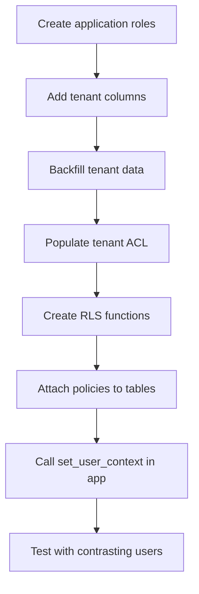

# VPD Setup Playbook

**Navigation:** Previous: [RBAC Setup Playbook](rbac.md) → Next: [Role Catalog](../../reference/role-catalog.md)

Follow this guide to enforce row-level security (RLS) so users only see the data they’re entitled to. Think of it as programming an elevator that stops only on authorised floors.

## Checklist Overview



## 1. Create Database Roles

Run during initial provisioning (already handled by onboarding scripts, but useful when cloning environments).

```sql
CREATE ROLE app_auth LOGIN PASSWORD '...';
CREATE ROLE app_payment_flow LOGIN PASSWORD '...';

GRANT USAGE ON SCHEMA auth TO app_auth;
GRANT USAGE ON SCHEMA payment_flow TO app_payment_flow;
```

Keep human superusers separate; application roles must operate with least privilege.

## 2. Add Tenant Columns

Ensure every protected table includes tenant identifiers.

```sql
ALTER TABLE payment_flow.payment_requests
    ADD COLUMN board_id VARCHAR NOT NULL,
    ADD COLUMN employer_id VARCHAR NOT NULL;
```

If the table already existed without these columns, backfill based on business rules (`UPDATE ... SET board_id = ...`).

## 3. Populate Tenant Data

Backfill `board_id` and `employer_id` for historical rows:

```sql
UPDATE payment_flow.payment_requests
SET board_id = origin.board_id,
    employer_id = origin.employer_id
FROM staging.origin_payments origin
WHERE origin.id = payment_requests.external_id;
```

Keep this script in version control; inconsistent tenant data is the most common RLS bug.

## 4. Build The Tenant ACL

```sql
INSERT INTO auth.user_tenant_acl (user_id, board_id, employer_id)
SELECT u.id, tenant.board_id, tenant.employer_id
FROM auth.user u
JOIN onboarding.seed_acl tenant ON tenant.username = u.username
ON CONFLICT (user_id, board_id, employer_id) DO NOTHING;
```

- Workers typically map to a single employer.
- Employers map to their organisation (often multiple workers).
- Board users usually receive `employer_id = NULL` to indicate “all employers”.

## 5. Create RLS Functions

```sql
CREATE FUNCTION auth.set_user_context(p_username text)
RETURNS void AS $$
BEGIN
    PERFORM auth.load_user_acl(p_username);
END;
$$ LANGUAGE plpgsql SECURITY DEFINER;
```

`auth.load_user_acl` reads from `auth.user_tenant_acl` and stores the tenant list in a session variable (e.g., `current_setting('auth.current_acl')`).

## 6. Attach Policies

Example for `payment_flow.payment_requests`:

```sql
ALTER TABLE payment_flow.payment_requests ENABLE ROW LEVEL SECURITY;

CREATE POLICY payment_requests_rls ON payment_flow.payment_requests
USING (
    auth.can_read_payment_request(board_id, employer_id)
);

-- Optional: separate write policy
CREATE POLICY payment_requests_write ON payment_flow.payment_requests
FOR UPDATE USING (
    auth.can_write_payment_request(board_id, employer_id)
);
```

`auth.can_read_payment_request` should inspect the ACL loaded by `set_user_context`.

## 7. Integrate In Application Code

- Call `auth.set_user_context(:username)` immediately after establishing a database connection (Spring `RLSContextFilter` handles this automatically).
- Ensure the application role is not a superuser; superusers bypass RLS entirely.

Example (pseudo Spring configuration):

```java
public void beforeInvocation(UserPrincipal principal) {
    jdbcTemplate.update("SELECT auth.set_user_context(?)", principal.getUsername());
}
```

## 8. Test With Contrasting Users

```sql
SET ROLE app_payment_flow;
SELECT auth.set_user_context('employer.demo');
SELECT COUNT(*) FROM payment_flow.payment_requests; -- should see employer-owned rows

SET ROLE app_payment_flow;
SELECT auth.set_user_context('worker.demo');
SELECT COUNT(*) FROM payment_flow.payment_requests; -- should see zero or own rows
```

Also test with a board user to confirm expanded access.

## Troubleshooting

| Symptom | Likely Cause | Fix |
| --- | --- | --- |
| Everyone sees all rows | Using superuser or missing policy | Use application role; ensure `ENABLE ROW LEVEL SECURITY` |
| Legit user sees nothing | ACL missing or tenant columns empty | Check `auth.user_tenant_acl`, verify column data |
| API returns 404 despite data | RLS hides row | Confirm tenant columns on the row; re-run ACL load |
| Performance issues | `set_user_context` or ACL lookups slow | Index `auth.user_tenant_acl(user_id, board_id, employer_id)` |

## Next Steps

- Review [VPD Checklist](../../reference/vpd-checklist.md) for audit-ready checks.
- If you added new capabilities or endpoints during this process, go back to [RBAC Setup Playbook](rbac.md) to ensure mappings stay in sync.
