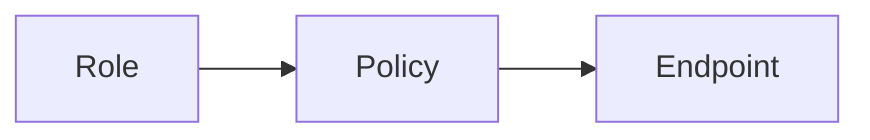

# Policy Matrix

**Navigation:** Previous: [Role Catalog](role-catalog.md) → Next: [VPD Checklist](vpd-checklist.md)

Policies now link roles directly to endpoints. Use this matrix to understand how decisions flow without wading through every SQL script.

## Policy Overview

| Policy | Activated By Roles | Primary Use Cases | Typical Endpoints |
| --- | --- | --- | --- |
| `PLATFORM_BOOTSTRAP_POLICY` | `PLATFORM_BOOTSTRAP` | Seed catalog, link policies, system bootstrap | `/api/admin/*`, `/api/system/*` |
| `ADMIN_TECH_POLICY` | `ADMIN_TECH`, `TEST_USER` | RBAC maintenance, user management, audit viewing | `/api/admin/roles/*`, `/api/admin/policies/*` |
| `ADMIN_OPS_POLICY` | `ADMIN_OPS`, `TEST_USER` | Operational dashboards, exception handling | `/api/ops/*`, `/api/audit/*` |
| `BOARD_POLICY` | `BOARD`, `TEST_USER` | Approval workflows, strategic reporting | `/api/board/*`, `/api/reporting/*` |
| `EMPLOYER_POLICY` | `EMPLOYER`, `TEST_USER` | Employer payment lifecycle actions | `/api/employer/*`, `/api/payment-requests/*` |
| `WORKER_POLICY` | `WORKER`, `TEST_USER` | Worker submissions and tracking | `/api/worker/*`, `/api/uploads/*` |

## Visual Flow



- Roles determine which policies activate.
- Policies reference endpoints.
- Endpoints are enforced dynamically at runtime via the catalog.

## Useful Queries

```sql
-- Which policies does a role trigger?
SELECT p.name, rp.is_active, rp.assigned_at
FROM auth.policies p
JOIN auth.role_policies rp ON rp.policy_id = p.id
JOIN auth.roles r ON r.id = rp.role_id
WHERE r.name = 'EMPLOYER'
  AND rp.is_active = true
ORDER BY p.name;

-- Which endpoints are protected by a policy?
SELECT e.method, e.path
FROM auth.endpoints e
JOIN auth.endpoint_policies ep ON ep.endpoint_id = e.id
JOIN auth.policies p ON p.id = ep.policy_id
WHERE p.name = 'EMPLOYER_POLICY'
ORDER BY e.path;
```

## When Adding Policies

- Policies are rare; most changes simply add endpoints to an existing policy.
- If a brand-new persona emerges, create a policy with clear naming (`<ROLE>_POLICY`).
- Update migrations, authorization endpoints, and documentation simultaneously.

## Deep Reference

- Archived capability mapping (legacy): `raw/RBAC/MAPPINGS/PHASE4_POLICY_CAPABILITY_MAPPINGS.md`
- Endpoint-policy matrix: `raw/RBAC/MAPPINGS/PHASE5_ENDPOINT_POLICY_MAPPINGS.md`
- Phase 1 endpoint extraction: `raw/RBAC/MAPPINGS/PHASE1_ENDPOINTS_EXTRACTION.md`

Use this matrix to understand the shape of the authorization catalogue before reaching for the exhaustive tables.
