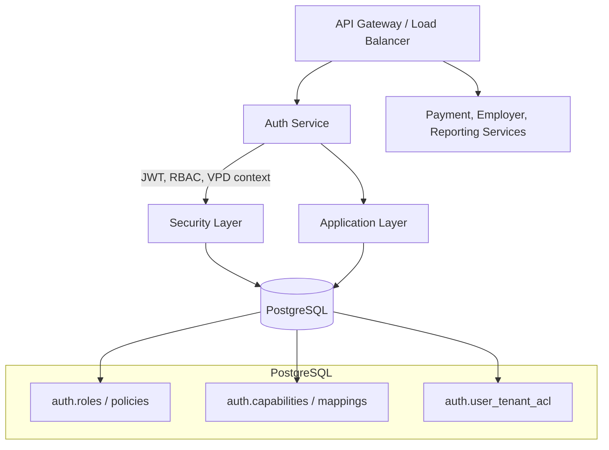
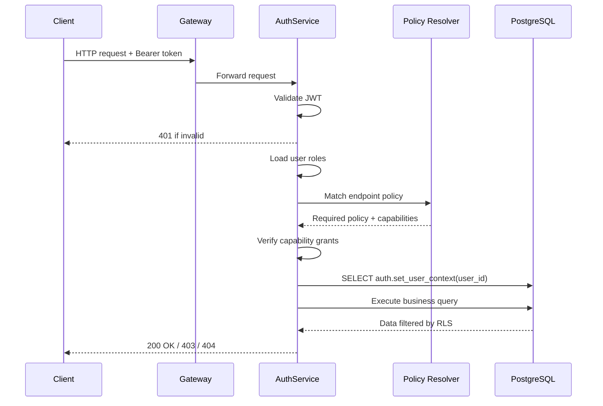

# Auth Platform Architecture

This document introduces the moving parts of the payment reconciliation auth stack so new engineers know how services, policies, and database protections fit together. Deep dives live in the focused folders (`../RBAC`, `../VPD`, `../POSTGRES`).

## Key Numbers

| Item | Count / Type |
| --- | --- |
| Roles | 7 production roles |
| Capabilities | 98 atomic capabilities |
| Endpoint mappings | 100+ HTTP routes |
| UI pages | 36 grouped screens |
| Policy-capability links | 288 |
| Authentication | JWT access tokens |
| Data isolation | PostgreSQL RLS (VPD) |

## Platform Topology

The auth service is authoritative for identity, policy enforcement, and setting the row-level security context that downstream queries rely on.

## Request Lifecycle

400-range responses surface when any gate fails:
- 401 – token missing or invalid.
- 403 – policy or capability mismatch.
- 404 – row-level security hides data after the query.

## Enforcement Layers

| Layer | What It Guards | Where to Update |
| --- | --- | --- |
| Endpoint policy | Verb + route level access | `RBAC/MAPPINGS/PHASE5_ENDPOINT_POLICY_MAPPINGS.md` |
| Capability bundle | Business actions allowed | `RBAC/DEFINITIONS/PHASE3_CAPABILITIES_DEFINITION.md` |
| Data isolation | Tenant row visibility | `VPD/README.md` & `ONBOARDING/setup/08_configure_vpd.sql` |

All three layers must allow the request for data to be returned.

## Role Snapshot

| Role | Focus | Approx. Capabilities |
| --- | --- | --- |
| PLATFORM_BOOTSTRAP | Initial catalogue seeding; disabled after bootstrap | 55 |
| ADMIN_TECH | RBAC and system configuration | 51 |
| ADMIN_OPS | Operational reconciliation tasks | 42 |
| BOARD | Board-level approvals and reporting | 17 |
| EMPLOYER | Employer management workflows | 19 |
| WORKER | Worker-facing upload and tracking | 14 |
| TEST_USER | Broad QA coverage mirroring production | 50 |

Full descriptions and capability lists sit in `../RBAC/ROLES.md`.

## Implementation Checklist

1. Execute the SQL scripts documented in `ONBOARDING/setup/README.md` (roles → capabilities → policies → seeds → RLS).
2. Deploy the auth service with the correct database credentials and JWT secrets.
3. Verify `/api/me/authorizations` and the SQL in `../RBAC/testing.md` to confirm policy and capability wiring.
4. Run the RLS smoke tests in `../VPD/testing/` with non-superuser roles.

## Related References

- `../RBAC/ARCHITECTURE.md` – detailed enforcement internals.
- `../VPD/README.md` – PostgreSQL implementation of tenant isolation.
- `../POSTGRES/README.md` – operational guidance for the shared database.
