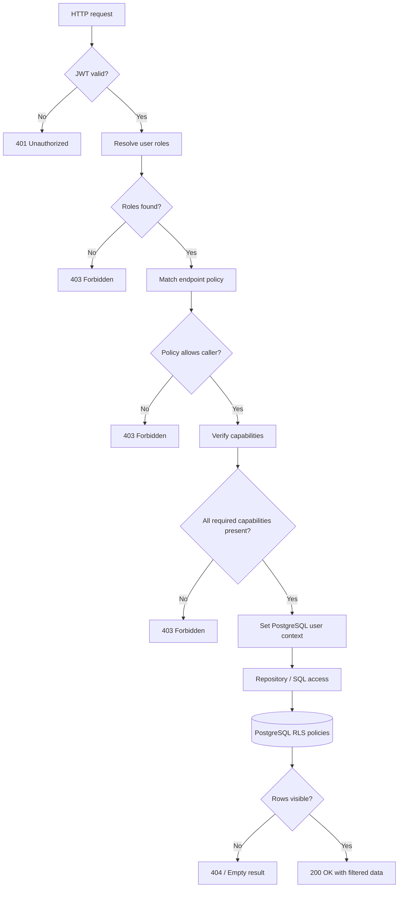
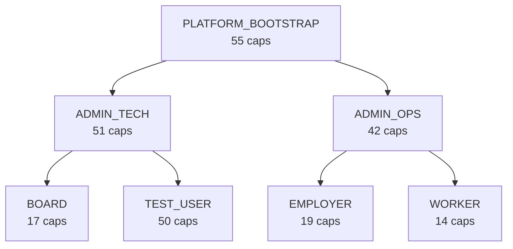

# RBAC Architecture

This note shows how a request flows through the auth service and where each enforcement decision happens. Pair it with `../VPD/README.md` for the row-level security specifics.

## Request Pipeline

## Flow In Depth

1. **Token intake (`AuthTokenFilter`)**  
   Parses the `Authorization` header, validates the JWT using `JwtUtils`, and populates Spring Security's context with the subject and token claims. Internal callers may also authenticate via `InternalApiAuthenticationFilter`.
2. **Role resolution (`AuthorizationService`)**  
   Looks up the user in `auth.user` and hydrates the assigned roles through `auth.user_role_assignment`. If no active role is present the request short-circuits with `403`.
3. **Endpoint lookup (`DynamicEndpointAuthorizationManager`)**  
   Normalises the request method/path, matches it against the catalogued entry in `auth.endpoint`, and pulls the bound policy ids from `auth.endpoint_policy`. Endpoint metadata is cached for 30 seconds to reduce catalog lookups.
4. **Policy evaluation (`PolicyEngineService`)**  
   Fetches policy JSON expressions from `auth.policy` and checks whether at least one policy admits the caller’s role set. Capability requirements are joined via `auth.policy_capability`.
5. **Capability check (`CustomPermissionEvaluator`)**  
   When `@PreAuthorize` expressions include `hasPermission(...)`, the evaluator ensures the caller’s capability bag (also sourced from `auth.policy_capability`) includes every required entry before controller execution continues.
6. **UI payload enrichment (`AuthorizationService`)**  
   For `/api/me/authorizations` the service fetches the allowed UI pages (`auth.ui_page`), actions (`auth.page_action`), and constructs the `can` dictionary that the front-end caches.
7. **Database context (`RLSContextFilter`)**  
   Issues `SELECT auth.set_user_context(<user_id>)` so PostgreSQL functions can apply tenant scoping through `auth.user_tenant_acl` when repositories touch business tables.

## Enforcement Layers

| Layer | Responsibility | Source of Truth |
| --- | --- | --- |
| Endpoint policy | Routes mapped to policies per HTTP verb | `auth.endpoint_policy` (see `MAPPINGS/PHASE5_ENDPOINT_POLICY_MAPPINGS.md`) |
| Capability set | Fine-grained actions linked to policies | `auth.policy_capability`, definitions in `DEFINITIONS/PHASE3_CAPABILITIES_DEFINITION.md` |
| Data isolation | Tenant scope enforced by PostgreSQL | `auth.user_tenant_acl` and RLS functions in `../VPD/README.md` |

## Role Hierarchy At A Glance

The counts summarise active capabilities per role; authoritative details remain in `ROLES.md`.

## Capability Model

- Capabilities use the `<domain>.<subject>.<action>` pattern, for example `payment.record.create`.
- Policies package capabilities for a role; they also drive the `@PreAuthorize` expressions in Spring Security.
- Additions or renames happen in `DEFINITIONS/PHASE3_CAPABILITIES_DEFINITION.md` and must be reflected in the SQL seeds.

## Integration Touchpoints

- **Spring Security filters** handle JWT verification and populate the security context.
- **Policy service** resolves endpoint policies and required capabilities before controller execution.
- **`RLSContextFilter`** issues `auth.set_user_context(<user_id>)` so PostgreSQL can enforce tenant ACLs.
- **Audit logging** records every 401/403 with the policy and capability identifiers that caused the denial.

## Example: Viewing Payment Details

Use this walkthrough when someone asks “Who can see the payment detail screen, and how is that enforced?”

1. **Role → Policy**  
   `EMPLOYER` users inherit `EMPLOYER_POLICY` (see `docs/ONBOARDING/setup/04_create_policies.sql`). The JSON expression `{"roles":["EMPLOYER"]}` makes the policy resolvable for any authenticated employer.
2. **Policy → Capability**  
   Linking `payment.details.read` to `EMPLOYER_POLICY` in `auth.policy_capability` (via `SELECT safe_policy_capability_link('EMPLOYER_POLICY', 'payment.details.read');`) declares that the policy grants the “view payment details” capability.
3. **Capability → Endpoint**  
   Endpoint `/api/v1/worker-payments/{id}` (GET) is catalogued in `auth.endpoint` and mapped to the same policy in `auth.endpoint_policy`. The Spring `DynamicEndpointAuthorizationManager` enforces that only callers with `EMPLOYER_POLICY` (and thus `payment.details.read`) pass the check.
4. **UI Page → Actions**  
   The UI page `Payment Details View` (`DEFINITIONS/PHASE2_UI_PAGES_ACTIONS.md`, section 2.4) has an action “View Payments” that also points at `/api/v1/worker-payments/{id}` and declares `payment.details.read` as the required capability.
5. **Run-time flow**  
   - The employer logs in; `AuthTokenFilter` validates the JWT.  
   - `AuthorizationService` assembles the role and capability set, finds `payment.details.read`, and includes the `Payment Details View` page in the `/api/me/authorizations` payload so the UI renders the link.  
   - When the UI calls `/api/v1/worker-payments/{id}`, the endpoint guard confirms the role matches `EMPLOYER_POLICY` and the `@PreAuthorize` decorator checks `payment.details.read`.  
   - `RLSContextFilter` sets the tenant context; PostgreSQL RLS ensures the employer only sees payments for their organisation.
6. **Audit trace**  
   Successful access is logged with the endpoint and policy id; denied requests include the missing capability so operations can diagnose why a user lacks access.
