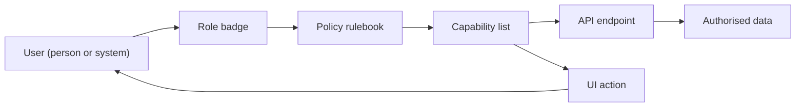
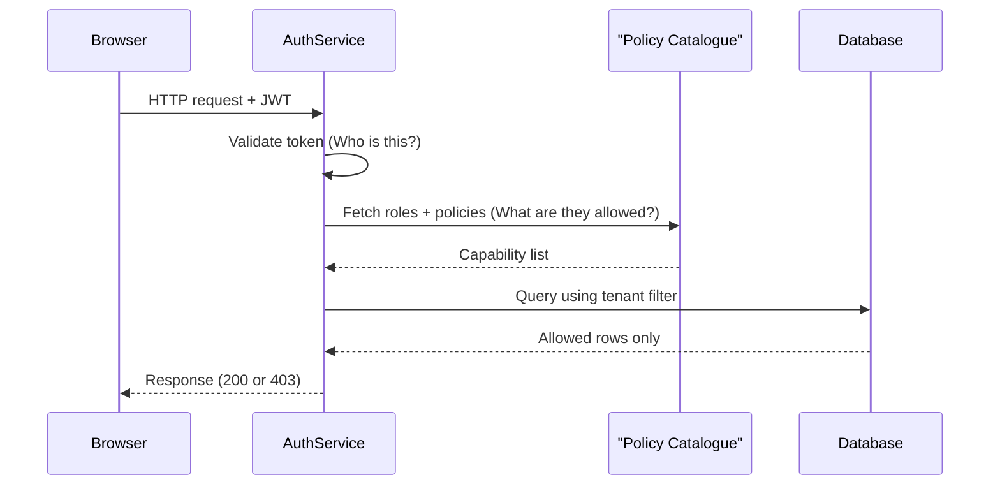
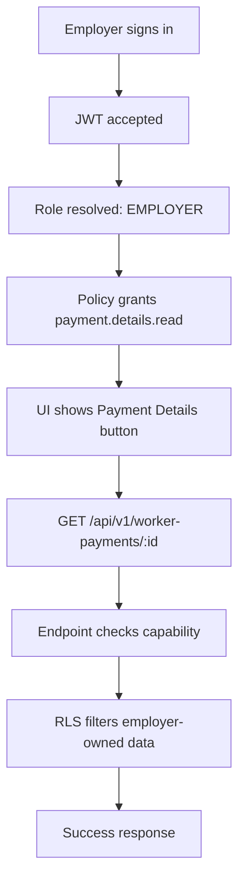

# RBAC Primer For New Team Members

Welcome! This walkthrough is for anyone joining the team who wants to understand how our role-based access control (RBAC) keeps the auth service safe. There is no need to know SQL, Spring, or PostgreSQL yet—just follow the story, skim the diagrams, and build a mental model you can use later.

## Why We Use RBAC

- **Protect sensitive actions** – Only the right people can trigger high-impact workflows such as approving payments.
- **Keep the UI focused** – Users only see the screens and buttons that match their job.
- **Make audits easier** – Every decision can be traced back to a role, policy, and capability.

We answer two questions for every request:
1. *“Who are you?”* (roles)  
2. *“What are you allowed to do?”* (capabilities)

If either answer is missing, access is denied.

## Meet The Cast



- **User** – A person or service account that signs in.
- **Role** – A responsibility badge (`EMPLOYER`, `ADMIN_OPS`, `WORKER`, etc.).
- **Policy** – A rule book that says “If you wear role X, you get these permissions.”
- **Capability** – A single permission named `<domain>.<subject>.<action>` (e.g. `payment.details.read`).
- **Endpoint** – The backend method+path that performs the work.
- **UI Page & Action** – The front-end view and button that let the user trigger the work.

## Request Flow At A Glance



Behind the scenes the service also writes an audit log so we know why a decision was made.

## How To Read An RBAC Decision

1. **Token arrives** – The service proves the JWT is authentic.
2. **Roles are loaded** – We fetch every role the user currently holds.
3. **Policy is located** – Policies linked to the endpoint are inspected.
4. **Capabilities are checked** – The policy must grant the exact capability the controller or UI action expects.
5. **Data scope is applied** – Even with permission, the user is limited to their tenant’s data.
6. **Result is returned** – Success (200), forbidden (403), or not found (404) if the data is hidden by scoping.

You can visualise it like a board game path:

```
Start → Validate token → Collect roles → Match policy → Check capability → Apply data scope → Finish
```

Failing any square bumps the user out with a 401, 403, or hidden result.

## Designing Permissions Step By Step

1. **Capture the goal** – Write down the plain-language outcome (`“View payment details”` beats “Access payments”).
2. **Pick the role** – Decide which job badge should do it; roles track responsibilities, not individuals.
3. **Name the capability** – Use `<domain>.<subject>.<action>` so the catalogue stays readable.
4. **Wire the UI** – Point the button or link at that capability so unauthorised users never see the option.
5. **Guard the endpoint** – Link the capability to the backend method; the API becomes the last line of defence.
6. **Play both sides** – Test as someone who should succeed and someone who should fail; both outcomes matter.

## Example Journey: “View Payment Details”



1. The employer logs in and receives a JWT.
2. The service loads the `EMPLOYER` role.
3. `EMPLOYER_POLICY` grants the capability `payment.details.read`.
4. The Payment Details button appears because the UI inspects that capability.
5. The request `GET /api/v1/worker-payments/{id}` is allowed because the endpoint is bound to the same capability.
6. The database still applies tenant filters so the employer cannot view another organisation’s payments.

## Story: The Curious New Employer

1. **Arrives at the dashboard** – Only employer-relevant tiles show because the UI reads the authorization matrix first.
2. **Clicks “Payment Records”** – The capability `payment.record.read` allows the list page to render.
3. **Opens a specific payment** – `payment.details.read` allows the detail card to load.
4. **Attempts an approval** – The approval button is hidden unless `employer.payment.approve` is present; even if someone calls the API directly it returns `403`.

Everything the employer sees or does can be traced back to a capability with a descriptive name.

## Glossary

- **Authorization Matrix** – The bundle of roles, capabilities, pages, and endpoints sent to the UI for a user.
- **Policy Expression** – A small JSON snippet that lists which roles activate a policy.
- **Tenant Scope** – The organisation boundary applied after authorization so data stays partitioned.
- **RLS** – Row-level security in PostgreSQL, the final filter that checks tenant ownership.
- **Audit Event** – Log entry describing why an action was permitted or blocked.

## Quick Self-Check

- Can you explain the difference between a role (responsibility) and a capability (permission)?
- Do you know which policy covers the role you care about?
- Can you point to the capability that unlocks a specific UI action?
- Are you confident the endpoint protecting the action is linked to the same capability?

If you can answer “yes”, you are ready to read `ARCHITECTURE.md` for the technical wiring or explore the setup guide when you need to seed data.
