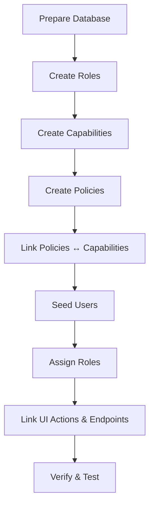

# RBAC Setup Guide

This guide is written for newcomers who want a step-by-step walkthrough of provisioning RBAC without having to reverse-engineer SQL scripts first. Follow it from top to bottom, treating each section as a checklist. Once you feel comfortable, the detailed scripts live under `../ONBOARDING/setup/`.

## Understand The Ingredients

- **Role** – A job badge for a user.
- **Policy** – A rule book that activates when a role is present.
- **Capability** – A single permission (named `<domain>.<subject>.<action>`).
- **Endpoint + UI Action** – The technical touchpoints that must recognise the capability.

Keep that chain in mind: `Role → Policy → Capability → Endpoint/UI`.

## Preconditions

- PostgreSQL 13+ (or above) reachable from your workstation.
- `psql` installed and able to log in as a user with permission to create tables.
- Repository cloned locally so you can run the setup scripts.

Quick smoke test:

```bash
psql -U postgres -d postgres -c "SELECT version();"
createdb -U postgres auth_service_db 2>/dev/null || true
```

If either command fails, pause here and confirm database connectivity before moving on.

## Bootstrap Steps



1. **Prepare the database**
   - Ensure you are connected to the target database (local or shared sandbox).
   - Set the search path to `auth` when running the scripts.
2. **Create the catalogue (scripts 01–04)**
   - `01_create_roles.sql` registers each job badge.
   - `02_create_ui_pages.sql` and `03_create_capabilities.sql` define what users can see and do.
   - `04_create_policies.sql` links roles to policies.
3. **Wire permissions (script 05)**
   - `05_link_policies_to_capabilities.sql` connects each policy to the capabilities it grants.
4. **Add example users (scripts 06–08)**
   - Seed accounts and assign roles so you can log in during testing.
   - Create page actions and connect them to the UI catalogue.
5. **Optional helpers**
   - The `RBAC/setup/` folder (for example `bootstrap_user_seed.sql`) adds richer demo data if needed.
6. **Restart the auth service**
   - After seeding, restart the auth-service container or application so caches reload the new data.

## Worked Example: Grant “View Payment Details”

**Scenario:** Imagine a brand-new employer user logging in for the first time. They want to open the Payment Details screen and call `GET /api/v1/worker-payments/{id}`.

1. **Confirm the capability exists**
   - Reference `DEFINITIONS/PHASE3_CAPABILITIES_DEFINITION.md` entry `payment.details.read`.
   - Validate in the database:
     ```sql
     SELECT id, name, description
     FROM auth.capabilities
     WHERE name = 'payment.details.read';
     ```
     If it is missing, add it to `03_create_capabilities.sql`, rerun the script, and re-seed dependent scripts.
2. **Attach the capability to the role’s policy**
   - Ensure the role is backed by a policy (`EMPLOYER` → `EMPLOYER_POLICY`, see `04_create_policies.sql`).
   - Link the capability using the helper in `05_link_policies_to_capabilities.sql`, or run it ad-hoc:
     ```sql
     SELECT safe_policy_capability_link('EMPLOYER_POLICY', 'payment.details.read');
     ```
   - Re-run `05_link_policies_to_capabilities.sql` in lower environments so the change is tracked in source control.
3. **Map the endpoint to the same policy**
   - Confirm the endpoint exists in `auth.endpoints` (catalog is seeded via the admin UI or ETL).
   - Add the endpoint → policy link:
     ```sql
     INSERT INTO auth.endpoint_policies (endpoint_id, policy_id)
     SELECT e.id, p.id
     FROM auth.endpoints e
     JOIN auth.policies p ON p.name = 'EMPLOYER_POLICY'
     WHERE e.method = 'GET'
       AND e.path = '/api/v1/worker-payments/{id}'
     LIMIT 1
     ON CONFLICT DO NOTHING;
     ```
   - Restart the auth service or clear `DynamicEndpointAuthorizationManager` cache if the service is already running.
4. **Expose the UI page/action**
   - Page `Payment Details View` (section 2.4 in `PHASE2_UI_PAGES_ACTIONS.md`) already points to the capability.
   - Verify the `page_actions` record is linked to the endpoint so `/api/me/authorizations` emits the button:
     ```sql
     UPDATE auth.page_actions pa
     SET endpoint_id = e.id
     FROM auth.endpoints e
     JOIN auth.capabilities c ON c.id = pa.capability_id
     WHERE c.name = 'payment.details.read'
       AND e.method = 'GET'
       AND e.path = '/api/v1/worker-payments/{id}'
       AND pa.endpoint_id IS DISTINCT FROM e.id;
     ```
5. **Refresh derived data**
   - Bounce the auth-service pod/container so caches pick up the new mapping.
   - If you rely on Redis-backed caches, invalidate the `authorization:*` keys so UI payloads are rebuilt.
6. **Validate end-to-end**
   - Run `psql -f docs/ONBOARDING/setup/09_verify_setup.sql` to ensure catalog integrity.
   - Call `GET /api/me/authorizations` as an employer user and check that `can.payment.details.read` is `true` and the `Payment Details View` page is present.
   - Invoke `GET /api/v1/worker-payments/{id}`; expect `200` when the record falls within the employer’s tenant scope, otherwise `404` due to PostgreSQL RLS.

## Verification Checklist

- `psql -U postgres -d auth_service_db -f docs/ONBOARDING/setup/07_verify_setup.sql`
- Run the SQL tests in `testing.md` to confirm role and capability grants.
- Call `/api/me/authorizations` with each seed user to ensure the API reflects the database state.
- Execute the RLS smoke tests in `../VPD/testing/` using non-superuser roles.

## If Something Fails

| Symptom | Likely Cause | Fix |
| --- | --- | --- |
| Roles missing | One of scripts 01–03 failed | Rerun 01–03; check psql output for conflicts |
| Capabilities mismatch | Definitions drifted | Re-run 02–04 and compare with `DEFINITIONS/PHASE3_CAPABILITIES_DEFINITION.md` |
| 403 on expected endpoints | Endpoint-policy mapping missing | Review `MAPPINGS/PHASE5_ENDPOINT_POLICY_MAPPINGS.md` and seed updates |
| Empty query results | RLS context not set | Confirm `08_configure_vpd.sql` ran and `RLSContextFilter` is active |

## Post-Bootstrap

1. Disable or rotate the `PLATFORM_BOOTSTRAP` credentials.
2. Update `application.yml` with the database URL, username, and password you used.
3. Document any environment-specific overrides separately; keep this guide environment agnostic.
