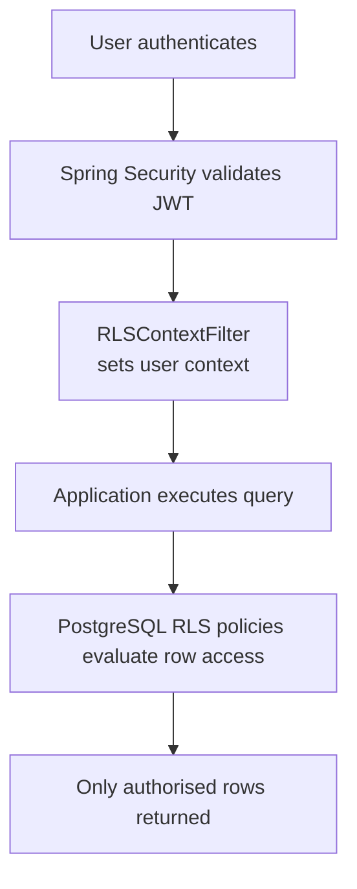
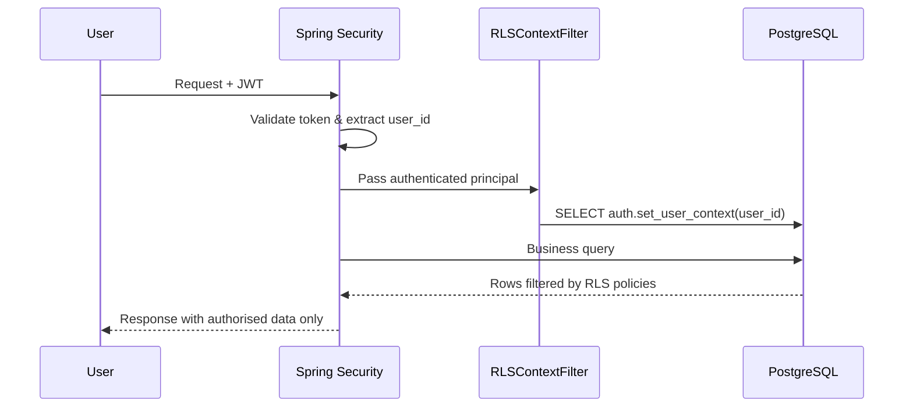

# Virtual Private Database (VPD) / Row-Level Security (RLS)

**Status:** ✅ Production Ready | **Last Updated:** November 2, 2025

## 📌 Quick Start

VPD/RLS automatically filters database rows based on user permissions at the **database layer**. Users cannot bypass it.

### How It Works



### Architecture Diagram



## 🎯 Key Concepts

### Tenant Keys

Every data table has two columns that control access:

| Column | Type | Purpose |
|--------|------|---------|
| `board_id` | VARCHAR | Which board owns this data (e.g., 'BOARD_1', 'BOARD_2') |
| `employer_id` | VARCHAR | Which employer owns this data (NULL = accessible to all employers) |

### Permission Matrix

| User ID | Role | Board | Employer | Can Read | Can Write |
| --- | --- | --- | --- | --- | --- |
| 1 | ADMIN | BOARD_1 | NULL | ✓ All | ✓ All |
| 8 | WORKER | BOARD_1 | EMP_2 | ✓ EMP_2 | ✗ |
| 2 | EMPLOYER | BOARD_1 | EMP_1 | ✓ EMP_1 | ✓ EMP_1 |

**Result:** User 8 with `BOARD_1 + EMP_2` sees only rows with that combination.

## 📂 Documentation Structure

- **Setup reference** – follow the SQL in `../ONBOARDING/setup/08_configure_vpd.sql` and its README notes
- **Testing snippets** – see the SQL files in the `testing/` folder inside this directory
- **Troubleshooting cues** – use the checklist below for common causes and fixes

## 🧪 Testing (Most Common Question)

### Why does superuser see ALL data?

**Root cause:** Superuser bypasses RLS by default. This is PostgreSQL's expected behavior.

**Solution:** Always test with the application role, not superuser:

```sql
-- ✅ CORRECT: This respects RLS
SET ROLE app_payment_flow;
SELECT auth.set_user_context('8');
SELECT * FROM payment_flow.worker_uploaded_data;

-- ❌ WRONG: Superuser bypasses RLS
SELECT auth.set_user_context('8');
SELECT * FROM payment_flow.worker_uploaded_data;
```

## ⚙️ Implementation Checklist

- [ ] Phase 1: Database roles created (`app_auth`, `app_payment_flow`, etc.)
- [ ] Phase 2: Tenant columns added to all data tables
- [ ] Phase 2: Columns backfilled with actual board/employer values
- [ ] Phase 3: ACL table (`auth.user_tenant_acl`) populated
- [ ] Phase 4: RLS functions created (`set_user_context`, `can_read_row`, etc.)
- [ ] Phase 5: RLS policies enabled on all data tables
- [ ] Phase 6: `RLSContextFilter` registered in Spring Security
- [ ] Verification: Different users see different data

## 🔍 Common Troubleshooting

| Issue | Cause | Fix |
|-------|-------|-----|
| Superuser sees BRD1, User 8 sees only BRD2 | Superuser bypasses RLS | Use `SET ROLE app_payment_flow` when testing |
| No rows returned when they should exist | ACL table is empty | Populate `auth.user_tenant_acl` with user permissions |
| RLS policies not filtering | Policies not enabled | Run Phase 5 migration script |
| User sees rows they shouldn't | Wrong ACL entries | Verify `user_tenant_acl` has correct board/employer combos |

## 📖 Next Steps

1. First-time setup → run the onboarding scripts through step 08 and confirm the checklist above.
2. Need to validate behaviour → execute the SQL under `testing/`.
3. Seeing incorrect results → work through the troubleshooting table and verify ACL data.
