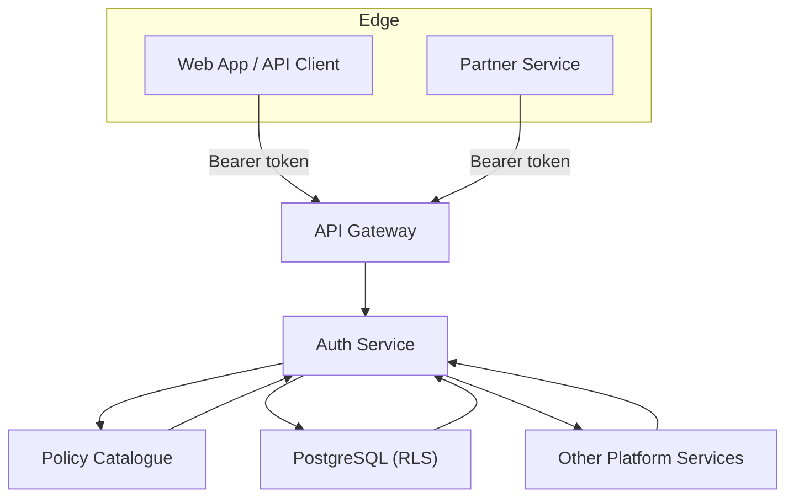
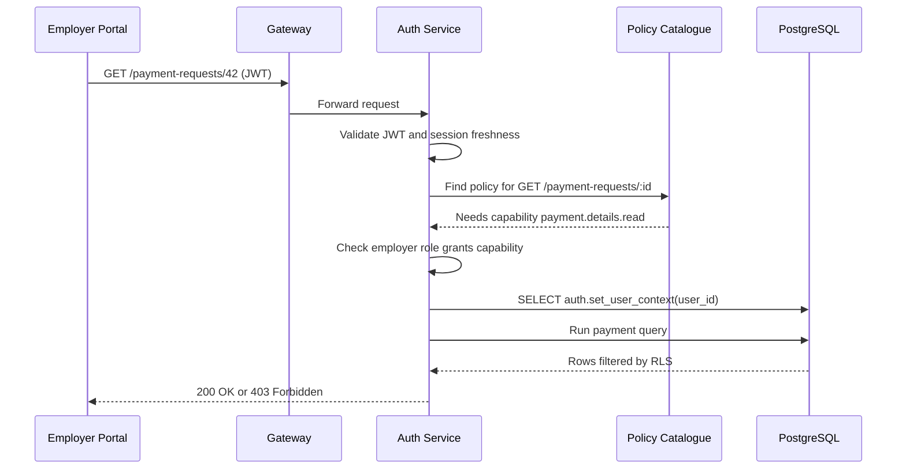

# Platform Tour

**Optional Prelude:** Ready for the detailed journey? Head next to [Architecture Overview](../architecture/overview.md).

This tour explains how the auth service keeps the payment reconciliation platform safe. Imagine a busy transit hub where every passenger, train, and cargo shipment must be checked, routed, and recorded. The auth service is the central control room coordinating those movements.

## Big Picture

- **Clients** bring tickets (JWTs) to the gateway.
- **Auth Service** checks the tickets, decides what’s allowed, and sets the “what data can you see?” context before the request continues.
- **Policy Catalogue** is the rulebook that links roles, policies, capabilities, and endpoints.
- **PostgreSQL** acts like the station turnstiles. Row-level security (RLS) ensures a request only sees the records it is allowed to see.
- **Other Services** rely on the context Auth sets to keep their own data safe.

## Request Story: Booking A Ticket

Picture a travel agent (employer) trying to view a worker’s payment request.

If the employer tries to grab another organisation’s request, RLS blocks the data—no extra coding required.

## Layers Of Protection

| Layer | Real-World Analogy | What Happens | Where To Adjust |
| --- | --- | --- | --- |
| Token validation | Bouncer checks ID | Reject expired, forged, or missing tokens | Spring Security config |
| Role membership | Badge on a lanyard | Look up roles tied to the user | `auth.user_role` table |
| Policy selection | Guard reads the shift roster | Match endpoint → policy → required capability | Policy catalogue |
| Capability check | Combination to open a door | Ensure capability list includes the requirement | `auth.policy_capability` |
| Data scope (RLS) | Elevator that only stops on permitted floors | Filter rows by board/employer ownership | `auth.set_user_context`, RLS policies |
| Audit trail | CCTV recording who went where | Log the decision for audits | Audit tables/logs |

All layers must say “yes” for data to flow.

## Components You’ll Work With

- **Auth Service (Java / Spring Security)** – Handles JWTs, role loading, policy evaluation, and sets database context.
- **Policy Catalogue (PostgreSQL tables)** – Stores roles, policies, capabilities, endpoint bindings, and UI permissions.
- **Virtual Private Database (RLS)** – Enforces tenant boundaries directly in SQL; think of it as invisible fencing around each tenant’s data.
- **Bootstrap Scripts (`../ONBOARDING/setup/`)** – Build the entire policy catalogue and RLS configuration from scratch.
- **Authorization API** – `/api/me/authorizations` returns the current user’s authorization matrix so front-end code can hide or show buttons accurately.

## First Feature Checklist

1. **Read the manifests** – `reference/role-catalog.md` explains who needs the capability.
2. **Name the capability** – Follow the `<domain>.<subject>.<action>` convention.
3. **Link policy and endpoint** – Update the policy catalogue (SQL or migrations).
4. **Expose to the UI** – Update the front-end to query `/api/me/authorizations` and gate the button.
5. **Verify data safety** – Run the scripts in `guides/verify-permissions.md` to ensure RLS still protects tenant data.

## Mental Model

Always imagine the auth service as **air traffic control**:

- Pilots (clients) file a flight plan (JWT).
- Controllers (policies) match the plan with the right runway (capabilities).
- Ground radar (RLS) ensures flights only taxi within their assigned lanes.
- The black box (audit) records every instruction.

Once that story clicks, the implementation details in the rest of the docs will feel much more approachable.
