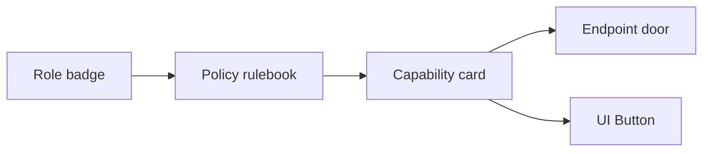

# Role Stories

**Optional Prelude:** After meeting the personas, start the main sequence at [Architecture Overview](../architecture/overview.md).

Each platform role is a character with a job to do. Think of the auth system as a high-security museum: every badge opens specific doors, and security cameras log every move. Use these stories to remember who can go where—and why.

| Role | Real-World Persona | What They Must Do | What They Cannot Do |
| --- | --- | --- | --- |
| PLATFORM_BOOTSTRAP | **Opening Crew** installing exhibits before launch | Configure the entire museum: create rooms (roles), rules (policies), alarms (capabilities), and door sensors (endpoints) | Visit once the museum opens; this badge should be retired after setup |
| ADMIN_TECH | **Head of Security Systems** | Keep the badge printer, alarm rules, and camera feeds up to date | Touch visitor exhibits or daily operations |
| ADMIN_OPS | **Operations Manager** on the museum floor | Monitor visitor flow, manage exceptions, review audit logs | Change security wiring or approve finances |
| BOARD | **Board Member** reviewing finances and strategy | Review and approve big-ticket exhibits and spending | Perform daily staff or visitor actions |
| EMPLOYER | **Corporate Event Planner** booking gallery space | Submit, review, and track payment requests for their organisation | See other companies’ events or worker data |
| WORKER | **Artist** submitting pieces for display | Upload documents, track personal payment status, correct their own data | View other artists’ submissions |
| TEST_USER | **Quality Inspector** with wide-ranging access in a sandbox | Validate that every hallway, sensor, and exhibit behaves as expected | Operate in production outside approved scenarios |

## How Roles, Policies, And Capabilities Relate

- **Roles** wake up policies.
- **Policies** hand out capability cards.
- **Capabilities** unlock API endpoints and show UI actions.

## Quick Reference

- **Need the raw capability list per role?** See `reference/role-catalog.md`.
- **Want to add a new responsibility?** Follow `guides/extend-access.md`.
- **Curious about how UI access ties in?** The front-end consumes `/api/me/authorizations`, which joins all the pieces together.

## Story: EMPLOYER Approves A Payment

1. Employer logs in and flashes the EMPLOYER badge.
2. Policy `EMPLOYER_POLICY` gives them the `payment.approval.submit` capability card.
3. The UI shows the “Approve Payment” button because it checks for that card.
4. The API endpoint `POST /payment-approvals` requires the same card and accepts the request.
5. RLS ensures the approval only touches the employer’s own data.

Use these stories when you explain access decisions to stakeholders—they resonate far more than table dumps.
