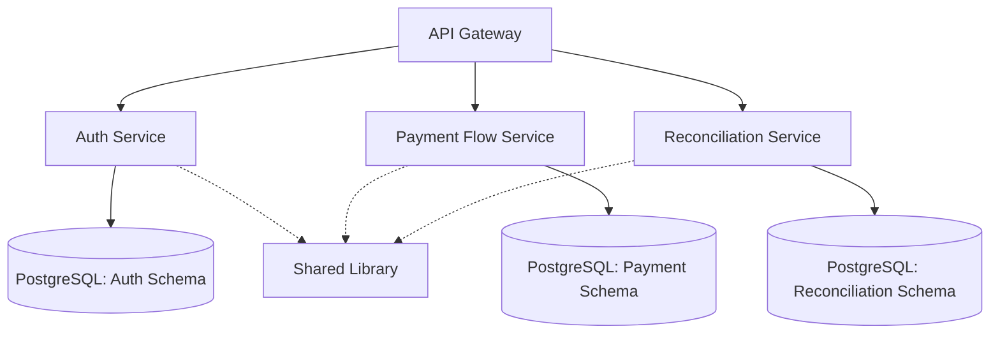

# LBE Platform Documentation

**Centralized documentation for the Labor Banking Exchange (LBE) platform services**

This repository serves as the single source of truth for:

- 📋 Architecture guides and patterns
- 🛠️ Development standards and best practices
- 🚀 Workspace setup and developer onboarding
- 📚 Service integration guides
- 🔐 Security and access control documentation

---

## 🎯 Quick Start

### New Developer Setup

```bash
# 1. Clone this repository first (to get setup tools)
git clone <documentation-repo-url>
cd documentation

# 2. Run the automated setup script
cd LBE/workspace-setup
./clone-all.sh

# 3. Open the multi-root workspace in VS Code
code lbe-services.code-workspace
```

**Full guide:** [LBE/workspace-setup/WORKSPACE_SETUP.md](LBE/workspace-setup/WORKSPACE_SETUP.md)

---

## 📂 Documentation Structure

```
documentation/
│
├── README.md                          ← You are here
│
├── LBE/                              ← Platform documentation
│   │
│   ├── README.md                     ← LBE guided journey (start here!)
│   │
│   ├── workspace-setup/              ← Developer environment setup
│   │   ├── WORKSPACE_SETUP.md        ← Detailed setup guide
│   │   ├── QUICK_START.md            ← Quick reference
│   │   ├── clone-all.sh              ← Automated repository cloning
│   │   └── lbe-services.code-workspace ← VS Code workspace config
│   │
│   ├── start/                        ← Getting started guides
│   │   └── ...
│   │
│   ├── onboarding/                   ← New team member onboarding
│   │   └── ...
│   │
│   ├── foundations/                  ← Core concepts
│   │   ├── access-control-101.md    ← RBAC explained
│   │   ├── data-guardrails-101.md   ← RLS and data security
│   │   └── postgres-for-auth.md     ← PostgreSQL patterns
│   │
│   ├── architecture/                 ← System design
│   │   ├── overview.md              ← System topology
│   │   ├── data-map.md              ← Entity relationships
│   │   ├── request-lifecycle.md     ← Request flow diagrams
│   │   ├── policy-binding.md        ← RBAC relationships
│   │   └── permission-patterns.md   ← Common patterns
│   │
│   ├── guides/                       ← How-to guides
│   │   ├── data-access-patterns.md  ← JPA vs jOOQ vs SQL templates ⭐
│   │   ├── request-lifecycle.md     ← Step-by-step request flow
│   │   ├── integrate-your-service.md← Service integration
│   │   ├── extend-access.md         ← Adding new capabilities
│   │   ├── user-management-crud-completion.md
│   │   ├── verify-permissions.md
│   │   ├── login-to-data.md
│   │   ├── local-environment.md
│   │   └── setup/                   ← Setup playbooks
│   │
│   ├── playbooks/                   ← Operational guides
│   │   └── ...
│   │
│   └── reference/                   ← API references & specs
│       └── ...
│
└── .github/                         ← GitHub-specific configs
    └── copilot-instructions.md      ← Master Copilot guidelines (optional)
```

---

## 🔑 Key Documents

### For New Developers

1. **[workspace-setup/WORKSPACE_SETUP.md](workspace-setup/WORKSPACE_SETUP.md)** - Set up your development environment
2. **[LBE/foundations/access-control-101.md](LBE/foundations/access-control-101.md)** - Understand RBAC
3. **[LBE/architecture/overview.md](LBE/architecture/overview.md)** - System architecture overview

### For Backend Developers

1. **[LBE/guides/data-access-patterns.md](LBE/guides/data-access-patterns.md)** ⭐ - **When to use JPA, jOOQ DSL, or SQL templates**
2. **[LBE/guides/request-lifecycle.md](LBE/guides/request-lifecycle.md)** - How requests flow through services
3. **[LBE/guides/integrate-your-service.md](LBE/guides/integrate-your-service.md)** - Integrate with the platform

### For Understanding Security

1. **[LBE/foundations/access-control-101.md](LBE/foundations/access-control-101.md)** - RBAC concepts
2. **[LBE/foundations/data-guardrails-101.md](LBE/foundations/data-guardrails-101.md)** - Row-level security
3. **[LBE/architecture/policy-binding.md](LBE/architecture/policy-binding.md)** - How permissions connect

---

## 🤖 GitHub Copilot Integration

This documentation is designed to work with GitHub Copilot. Each service repository has a `.github/copilot-instructions.md` file that:

1. **References** key documents from this repository
2. **Embeds** critical guidelines directly
3. **Guides** Copilot to follow platform standards

### How It Works

When you open the **multi-root workspace** (`lbe-services.code-workspace`), GitHub Copilot can:

- ✅ Read all documentation files
- ✅ Reference patterns from guides
- ✅ Follow service-specific rules from `.github/copilot-instructions.md`
- ✅ Generate code that adheres to platform standards

### Service Copilot Instructions

Each service has embedded guidelines:

- **auth-service/.github/copilot-instructions.md** - Auth service patterns
- **payment-flow-service/.github/copilot-instructions.md** - Payment flow patterns
- **reconciliation-service/.github/copilot-instructions.md** - Reconciliation patterns

These files embed content from this documentation project and add service-specific context.

---

## 📋 Platform Standards

### Data Access Layer ⭐

**See:** [LBE/guides/data-access-patterns.md](LBE/guides/data-access-patterns.md)

| Pattern                  | Use When                                         | Example                                |
| ------------------------ | ------------------------------------------------ | -------------------------------------- |
| **Spring Data JPA**      | CRUD operations, entity lifecycle, auditing      | `userRepository.save(user)`            |
| **jOOQ DSL**             | Complex reads, multi-table joins, type safety    | `dsl.select()...from()...join()`       |
| **jOOQ + SQL Templates** | Analyst-owned queries, reports, frequent changes | `SqlTemplateLoader.load("report.sql")` |

### Architecture Patterns

- **Layered Architecture**: Controller → Service → DAO/Repository → Database
- **Request Lifecycle**: JWT validation → Policy check → RLS enforcement
- **Error Handling**: Centralized exception handling with standardized responses
- **Audit Logging**: All authorization decisions logged for compliance

### Code Quality

- **Validation**: Bean Validation (JSR 380) at controller layer
- **Testing**: Unit tests for business logic, integration tests for data access
- **Logging**: Structured logging with correlation IDs
- **Security**: Never bypass RLS, always set user context

---

## 🏗️ Service Architecture



### Services

- auth-service: Authentication, authorization, user/role/policy management
- payment-flow-service: Payment processing and worker/employer management
- reconciliation-service: Payment reconciliation workflows
- shared-lib: Common utilities, exceptions, and patterns

---

## 🔄 Keeping Documentation in Sync

### When to Update Documentation

1. **New data access pattern** → Update `LBE/guides/data-access-patterns.md`
2. **Architecture change** → Update `LBE/architecture/overview.md`
3. **New security pattern** → Update relevant foundation docs
4. **New setup requirement** → Update `workspace-setup/WORKSPACE_SETUP.md`

### Updating Service Copilot Instructions

When you update a guide in this repository:

1. **Don't** update individual service copilot-instructions files
2. **Do** ensure the guide is comprehensive and self-contained
3. **Do** test that Copilot can read it from the multi-root workspace
4. **(Optional)** If a pattern is critical, consider embedding it in service-specific instructions

### Documentation Review Process

- Documentation changes require review from platform team
- Major architectural changes require approval from tech lead
- Keep guides practical with real examples
- Update diagrams when flows change

---

## 🚀 Distribution Models

### Option 1: Monorepo (Current Setup)

All services and documentation in one repository. Developers clone once.

```bash
git clone <monorepo-url>
code lbe-services.code-workspace
```

### Option 2: Separate Repositories

Each service is its own repository. Documentation repository is cloned first.

```bash
# Clone documentation first
git clone <documentation-repo>
cd documentation/workspace-setup

# Run setup script to clone all services
./clone-all.sh

# Open workspace
code lbe-services.code-workspace
```

### Option 3: Documentation as Submodule

Each service includes documentation as a Git submodule.

```bash
git clone <auth-service-repo> --recursive
```

**Recommendation:** Option 1 (monorepo) or Option 2 (separate repos with setup script) work best with Copilot.

---

## 🧪 Verifying Setup

After opening `lbe-services.code-workspace`:

### Test 1: Documentation Access

1. Open any copilot-instructions.md file
2. Cmd+Click on a documentation path
3. Should open the file from the documentation folder

### Test 2: Copilot Code Generation

In any Java service file, type:

```java
// Create a method to fetch active users with pagination using jOOQ DSL
```

Copilot should generate code following `LBE/guides/data-access-patterns.md`.

### Test 3: Cross-Service Context

In payment-flow-service, type:

```java
// Call auth service to verify user has payment.approve policy
```

Copilot should suggest appropriate REST client code.

---

## 📞 Support

- **Platform Team**: Contact for architecture questions
- **Security Team**: Contact for access control questions
- **DevOps Team**: Contact for infrastructure questions

---

## 📜 License

Internal use only. All rights reserved.

---

**Last Updated:** November 2025  
**Maintained by:** Platform Engineering Team
